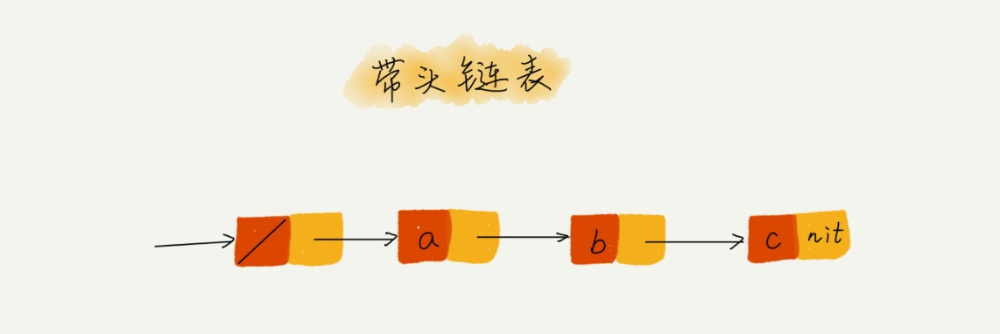
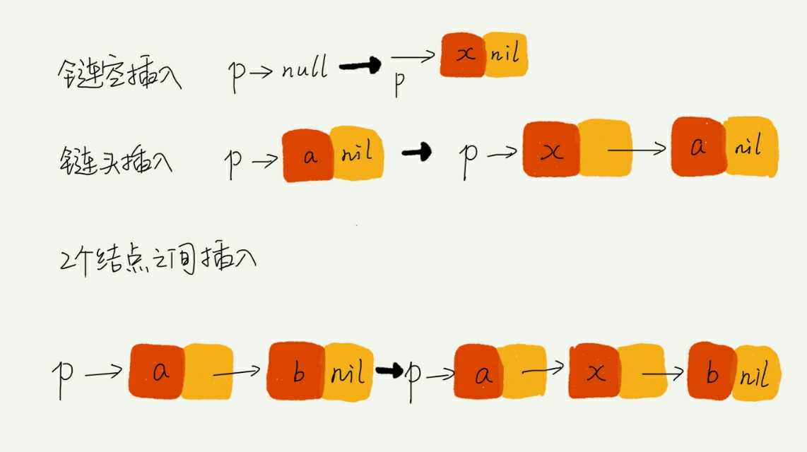

# 链表(下) 如何正确的写出链表代码

## 上一讲已经使用 js 写过一个单链表来实现基本的 LRU 的功能, 但是还远不够.现在梳理一下手写链表需要注意的点:

### 理解指针或引用的含义

#### 在链表中的每一个结点都有一个 next 的属性, 其本质便是一个引用或指针, 指向下一个结点的位置或理解为内存地址

### 警惕指针丢失和内存泄漏
#### 因为不停地在进行引用和指针的切换, 如果其中有一个部分出错将会导致某些部分的内存地址没有被引用, 就会出现内存泄漏和指针丢失, 请看下面插入一个新结点的代码
```js
p.next = x
x.next = p.next
// x.next = x
```
#### 这样便会导致 x 引用自身, 从而导致了 p 以后的所有结点都会丢失, 造成内存泄漏和指针丢失, 要解决该问题只需要 调换一下位置
```js
x.next = p.next
p.next = x
```
#### 这样就可以正常使用了

### 利用哨兵来简化实现难度

#### 还是之前的插入操作为例, 如果向一个空链表插入第一个结点, 该代码就无法使用了, 因为没有对应的 p, 所以就需要进行判断
```js
if( this.head == null) {
  head = new_node
}
```
#### 同样的, 如果是删除链表中的最后一个结点, 需要特殊处理
```js
if( head.next === null) {
  head = null
}
```
#### 这样每次的链表插入和删除都需要特殊考虑, 有没有一种办法可以将两者考虑进去从而简化代码, 就需要使用哨兵, 即 不管链表是否为空, head 指针都会指向这个哨兵结点, 带有这种哨兵结点的链表成为带头链表. 注意: ** 哨兵结点没有储存数据 **


#### 比如在查找的时候, 需要判断是否是最后一个, 那么可以使用一个哨兵结点
```js
let a = [1,2,3,4,5]
let l = a.length
let i = 0
function find_index(item) {
  if (a[l - 1] === item) {
    return l - 1;
  }
  // 设置哨兵结点
  a[l - 1] = item
  while(a[i] !== item) {
    i ++
  }
  // 没有对应元素
  if (i === l-1) {
    return -1
  } else {
    return i
  }
}
```
#### 如果没有哨兵元素的话, 在 while 里就需要多一层判断, 即`while(a[i] !== item && i < l)`, 会多浪费一次比较的性能.
### 重点留意边界条件处理, 主要有:
- 如果链表为空时
- 如果只包含一个结点时
- 如果只包含两个结点时
- 处理头结点和尾结点时
### 举例画图, 辅助思考

### 多写多练, 包括

- 单链表反转
- 链表中环的检测
- 两个有序链表的合并
- 删除链表倒数第 n 个结点
- 求链表的中间结点

#### 单链表的反转
```js
function revert(old_head=this.head) {
  var next = old_head.next
  if (!next) {
    return console.log('revert finished:', this.display())
  }
  var nextnext = old_head.next.next
  next.next = this.head
  old_head.next = nextnext
  this.head = next
  this.revert(old_head)
}
```

#### 链表中环的检测, 如果成环返回入口以及环的长度
- 快慢指针
```js
function detect_circle() {
  var point_slow = this.head.next
  var point_fast = point_slow.next
  while(point_slow && point_fast) {
    // 如果追上了就返回为环
    if(point_slow === point_fast) {
      var n = 1
      point_slow = point_slow.next
      while(point_slow !== point_fast) {
        point_slow = point_slow.next
        n++
      }
      var new_point_slow = this.head
      var new_point_fast = this.head
      var length = n
      while(n > 1) {
        new_point_fast = new_point_fast.next
        n--
      }
      debugger
      while(new_point_fast !== new_point_slow && new_point_fast.next !== new_point_slow) {
        new_point_slow = new_point_slow.next
        new_point_fast = new_point_fast.next.next
      }
      return `true, cycle entry = ${new_point_slow.element},  cycle length = ${length}`
    }
    point_slow = point_slow.next
    if (!point_fast.next) {
      return false
    }
    point_fast = point_fast.next.next
  }
  return false
}
```

#### 两个有序链表的合并
```js
function merger(link_list1, link_list2) {
  function merge(Node1, Node2) {
    var head
    debugger
    if (Node1 === null || Node2 === null) {
      return (Node1 || Node2)
    }
    if (Node1.element > Node2.element) {
      head = Node2
      head.next = merge(Node1, Node2.next)
    } else {
      head = Node1
      head.next = merge(Node1.next, Node2)
    }
    return head
  }
  return merge(link_list1.head, link_list2.head)
}
```
#### 删除倒数第 n 个结点, 可以先将列表反转, 然后再取值
```js
function get_reverse_num(llist, num) {
  llist.revert()
  var current_head = llist.head
  for (;num > 1;num--) {
    current_head = current_head.next
  }
  return current_head
}
```
#### 求链表的中间结点, 可以将列表反转, 位置没有更改的为中间值
```js
function get_mid_point(llist) {
  const common = []

  var origin = llist.display()
  llist.revert()
  var after = llist.display()
  for (let i = 0; i < origin.length; i ++ ) {
    if (origin[i] === after[i]) {
      common.push(origin[i])
    }
  }
  return common
}
```
