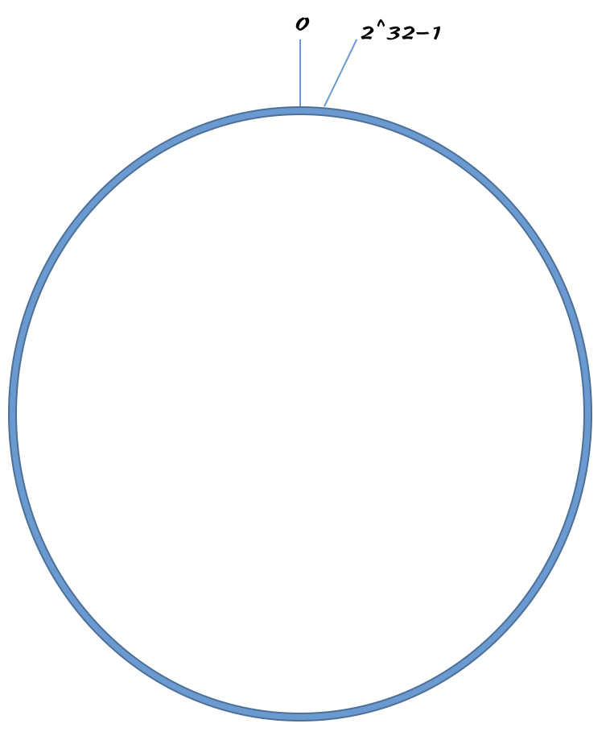

# 哈希算法在分布式系统中的应用

## 在第20节中讲了哈希算法的四个应用
- 安全加密
- 散列函数(哈希函数)
- 数据校验(MD5)
- 唯一标识

## 本节讲解其余的三个应用
- 负载均衡
- 数据分片
- 分布式储存(重要)

## 负载均衡
### 之前已经说到了好几种负载均衡的函算法
- 轮询
- 随机
- 加权轮询

### 那如何实现会话粘滞呢?
即 在同一个客户端中, 一次会话的所有请求都路由到同一个路由器中
最直接的办法是维护一张客户端IP或者会话ID与服务器编号的映射关系, 客户端发出的每次请求, 都先要在映射表中找到对应的服务器编号. 虽简单直观, 但弊端也很明显
- 如果客户端很多, 映射表可能会很大, 比较浪费空间
- 客户端下线, 上线,服务器扩容, 缩容都会导致映射失败, 维护成本大

第二种方法:
- 借助哈希算法, 对客户端IP或会话ID求哈希值
- 取得的哈希值与服务器列表大小进行取模运算, 最终得到的值为被路由的服务器编号

这种方式的内存成本小, 哈希表的大小为服务器数量那么大, 客户端上下线, 服务器扩缩容并不影响, 缺点是每次请求过来都需要对客户端IP或会话ID做哈希运算

## 数据分片
### 如何统计"搜索关键字"出现的次数?
加入有1T的日志, 里面记录了用户的搜索关键词, 如何快速统计出每个关键词被搜索的次数?
难点:
- 日志太大, 把这1t日志放到内存里不够现实
- 可以切分成n个日志, 使得内存能装下, 然后再去统计, 但是一台处理器处理时间太长了
  
可以先进行数据分片, 然后让多台机器分布式处理
- 假设有n台机器
- 对每条数据哈希化, 然后与n求模运算后保存到对应的机器中, 这样同一个搜索关键词都会保存在同一个机器里
- 每台机器分别计算关键词出现的次数
- 合并起来得到一张总表

这样的处理过程也是 **MapReduce** 的基本设计思想

### 快速判断图片是否在图片库中
上一讲的时候介绍了一种方法, 对所有的图片哈希化, 构建散列表

但是如果数据库中有1亿张图片, 在单台机器上构建散列表是行不通的了(内存有限), 此时可进行数据分片
- 准备n台机器
- 从图库中取一张图片, 哈希化, 对n求模, 将图片路径和哈希化后的值, 保存到对应编号的机器里.
- 判断时取出一张图, 哈希化之后同样求模, 在对应编号的机器上的哈希表中进行检测.

机器数量n的估算
- MD5 128比特, 16字节, 路径长度上限时256字节, 平均长度为128字节, 如果用链表法解决冲突, 指针8字节, 所以散列函数每个数据单元占用为(16+128+8) = 152字节(估算)
- 机器内存2GB, 散列表装载因子: 0.75
- 2GB * 0.75 / 152byte 约等于1000万张, 所以要对1亿张构建的话, 大约需要十几台机器(有备用容灾)

### 实际上, 针对这种海量数据, 海量用户, 为了提高数据的读取率都可以使用分片方式来突破单机内存和CPU的限制

## 分布式储存
### 如刚才说到的分片, 其实就是一种分布式储存, 但是有一个问题需要考虑:
**假设最初有10台机器, 都维护着各自的路由表 如果数据在持续的增长, 最后不得不新增一台机器, 那么问题就来了, 并不是简单的加一个机器就可以的**
原来的数据是对10取模, 比如13这个数据, 是存在3这个机器中的, 现在加了一个, 变成了11台, 那么需要对11取模了, 13就变成了编号为2的机器中, 这样所有的数据都需要进行搬移, 到一个新的取模哈希表中, 这就相当于一下子所有的数据都是小了, 请求都会穿透缓存, 到数据库中请求, 就可能发生雪崩效应, 压垮数据库(当然, 为了让原来的数据不失效, 可以使用冗余算法, 保存原有的哈希表, 先在原有哈希表中找, 找不到再再新表中找, 但是这样就需要维护两张, 而且数量很大的话是没有多余的空间维护两个哈希表的)

所以, 需要有一种方法, 在新加入机器后, 并不需要做大量的数据迁移, 大部分的数据需要依然保持可用, 这时候**一致性哈希算法**就登场了.
- 假设有k个机器, 数据的哈希值范围为[0, MAX],
- 将整个范围分成m个小区间, m远大于k, 每个机器负责处理m/k个小区间
- 当有新机器加入的时候, 就将某个小区间的数据进行搬移, 而不用对整个哈希表进行搬移

### 可以将整个哈希表看成一个圆, 圆上一共有2的32次方个点, 所以整个换的范围就是[0, 2^23-1], 也就是上面流程中的 MAX = 2^23-1

### 一共有5个机器, k = 5, 假设均匀分布.

### 将整个范围分成假设100个区间, m = 100, 每个机器负责处理100/5 = 20个小区间

### 如果新插入一个机器

