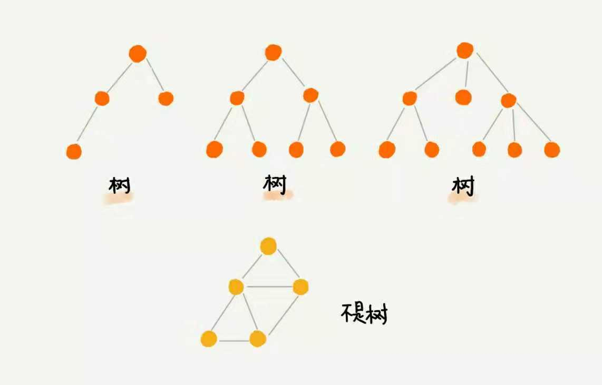
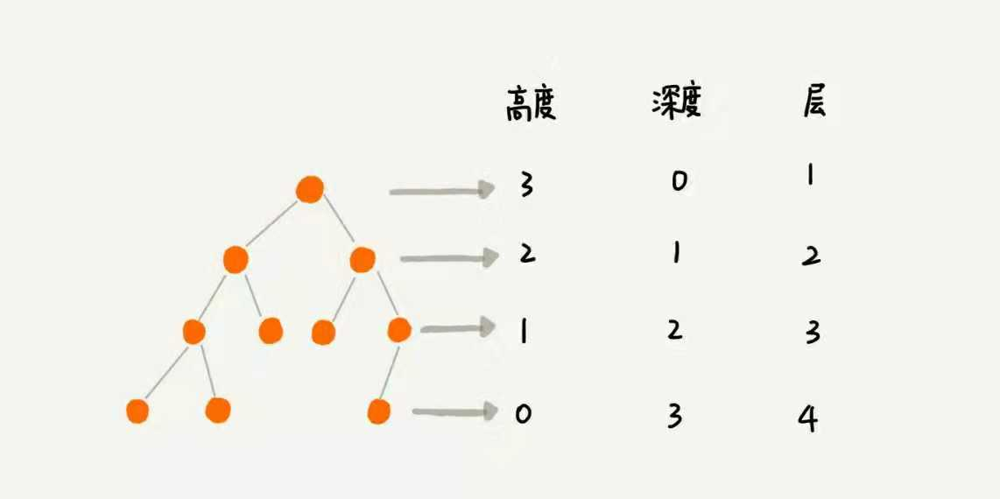
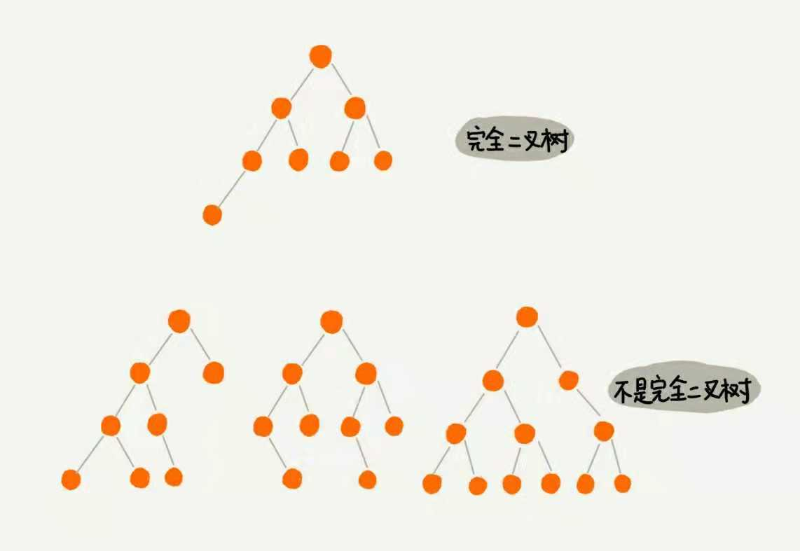
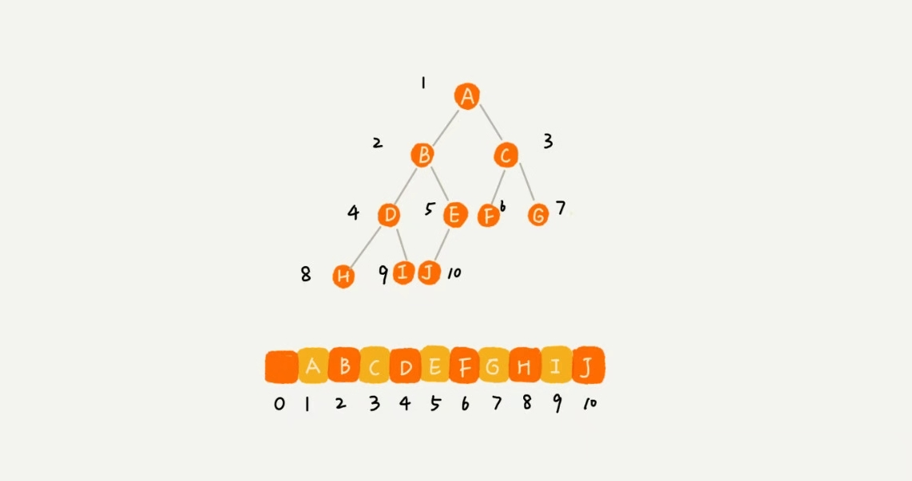

# 二叉树(上) 什么杨的二叉树适合储存数组

## 前面所讲的数据结构都是线性表结构, 栈, 队列等, 有一种非常重要的非线性表结构 - 二叉树, 在数据结构中有及其重要的作用
### 首先看看什么是树: 单向向下,节点间的关系只有上下, 没有左右.如下图所示

### 每个节点的关系:
- 最顶部的被成为根节点
- 最底部的被成为叶子节点(也是特殊的子节点)
- 在叶子节点和根节点之间是子节点
- 子节点的上一级为父节点.
- 同一层级的被称为兄弟节点

### 树的特性
- 节点高度-从本节点到叶子节点经历的最长边数(从0开始) --> 从下往上数
- 节点深度-从根节点到本节点的边数(从0开始) --> 从上往下数
- 节点层-节点的深度+1
- 树的高度为根节点的高度



## 二叉树: 最常用的树结构

### 每个节点最多只包含两个子节点的树结构成为二叉树, 被包含的两个子节点分别被称为"父节点", "子节点".
- 满二叉树: 除了叶子节点, 所有的节点都有两个子节点, 特殊的完全二叉树
- 完全二叉树: 叶子节点从左到右可以被分成两边, 左右两个子树所有非叶子节点都有两个子节点, 右边子树的深度比左边字数深度少1
- 非完全二叉树就是除了以上两种以外的二叉树



### 为什么要把完全二叉树单独抽离出来? 因为二叉树的表示方法一共有两种, 一种是链表, 只不过链表有两个next, 一个是next-right, 一个是next-left, 需要花不少指针空间取储存, 另一个方式就是数组了, 完全二叉树可以通过数组来表示, 除了浪费索引为0的位置外, 其他的都可以占满, 而非完全二叉树则会有很多地方空余, 所以完全二叉树用数组储存是最节省内存的方式

#### 如何用数组取储存呢?
假设根节点储存A在下标为i = 1的位置, 那么他的左节点B就在 2 * i = 2的位置, 右节点C在2 * i + 1 = 3的位置, 那么B的左节点就是 2 * j = 4, C的左节点是 2 * j + 1 = 5


### 二叉树的遍历, 都是递归的过程
- 前序遍历: 本节点 --> 左子树 --> 右子树 preOrder(r) = print r --> preOrder(r-->left) --> preOrder(r-->right)
- 中序遍历: 左子树 --> 本节点 --> 右子树 midOrder(r) = preOrder(r-->left) --> print r --> preOrder(r-->right)
- 后序遍历: 左子树 --> 右子树 --> 本节点 postOrder(r) = postOrder(r-->left) --> postOrder(r-->right) --> print r
```js
// abstruct
function preOrder(r) {
    console.log(r)
    if (r.left) {
        preOrder(r.left)
    }
    if (r.right) {
        preOrder(r.right)
    }
}
// 假设完全二叉树的结构是以下的数组形式
var list = [0,3,4,5,2,1];
//detail
function preOrder(i, list) {
    console.log(list[i])
    if (2 * i < list.length - 1) {
        preOrder(2 * i, list)
    }
    if(2 * i < list.length - 1) {
        preOrder(2 * i + 1, list)
    }
}
// 同理可得其他的两种遍历方式
```
遍历的每个节点最多被访问两次, 所以二叉树遍历的时间复杂度为O(n)

## 课后问题
1 子树数据为2,3,5,6,4,1, 可以组成多少种不同的二叉树
2 如何实现按层遍历?


