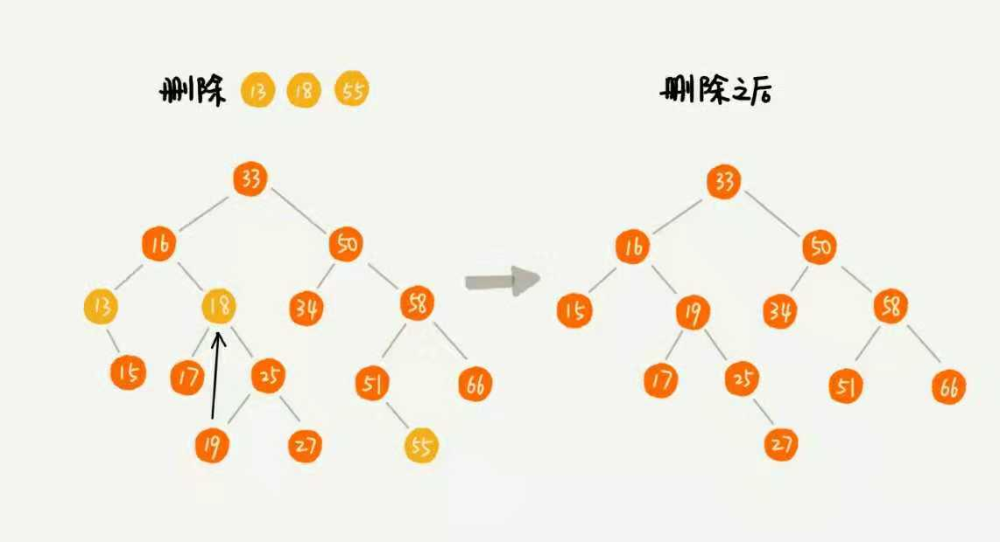

# 有了高效的散列表为什么还需要二叉树

## 散列表的这些操作复杂度都是1, 如此的高效, 为什么还要使用二叉树? 这里有一个很本质的问题, 散列表的排序十分的不方便.

## 这一讲的主角是一个特殊的二叉树, 即 二叉查找树.二叉查找树最大的特点即:

- 动态数据集合的快速插入, 删除, 查找等操作

## 这些快速的操作都依赖于二叉树的特殊结构, 在树中的任意一个节点, 他的左节点都比这个节点的数小, 右节点都比这个节点的数大, 如下图


## 二叉树的查找操作数V:

- 取根节点, 如果是需要的数据则返回根节点
- 判断V是否大于当前节点, 如果小于则遍历到左子节点, 如果大于则遍历右子节点
- 如果当前节点等于待查找值V, 则返回该节点, 否则当前节点不为叶子节点且, 重复上一操作, 如果为叶子节点则返回没找到.

```js
function findBst (node, value) {
    if (node.value === value) {
        return node
    }
    if (node.value > value && node.right) {
        return findBst(node.right)
    }
    if (node.value < value && node.left) {
        return findBst(node.left)
    }
    return 'Not Found'
}
class Node {
    private value:int;
    private left:Node;
    private right:Node;
    constructor(value, left, right) {
        this.value = value;
        this.left = left;
        this.right = right;
    }
}
```

## 二叉查找树的插入操作插入值为V

- 从根节点开始遍历
- 如果V大于等于当前节点且右子节点为空, 则插入到右子节点, 如果右子节点不为空, 则递归遍历右子树
- 如果V小于当前节点且左子节点为空, 则将V插入左子节点即可, 如果左子节点不为空, 则遍历左子树

```js
function insertBst(node, value) {
    if (value < node.value) {
        if (!node.left) {
            node.left = new Node(value, null, null)
            return
        }
        return insertBst(node.left, value)
    } 
    if (value > node.value) {
        if (!node.right) {
            node.right = new Node(value, null,null);
            return
        }
        return insertBst(node.right, value)
    }
}
```

## 二叉查找树的删除操作删除值V

- 如果删除的节点没有字节点, 那么只需要将父节点中指向该节点的指针设为null
- 删除的节点只有一个子节点(左节点或右节点), 只需要更新父节点指向该节点的指针设为待删除节点的子节点
- 删除的节点右两个字节点, 这就比较复杂了, 需要找到节点中的右子树中的最小节点, 把他替换到待删除的节点

先看一张图, 直观感受删除的规则



```js
function deleteBst(currentNode, parentNode, direction, deleteValue) {
    // 查找到对应的节点, 需要对查找操作进行处理, 需要返回父节点的关系
    const node = findBst(node, value)
    // 判断有没有左节点或右节点, 分三种情况
    // 没有左右节点

    if (currentNode.value === deleteValue) {
        return parentNode[direction] = null
    }
    if (currentNode.value < deleteValue) {
        parentNode = currentNode
        direction = 'left';
        currentNode = currentNode[direction]
        return deleteBst(currentNode, parentNode, direction, value)
    }
    if (currentNode.right)
    // 查找右子树中的最小数
    parentNode = currentNode
    direction = 'right';
    currentNode = currentNode
}
