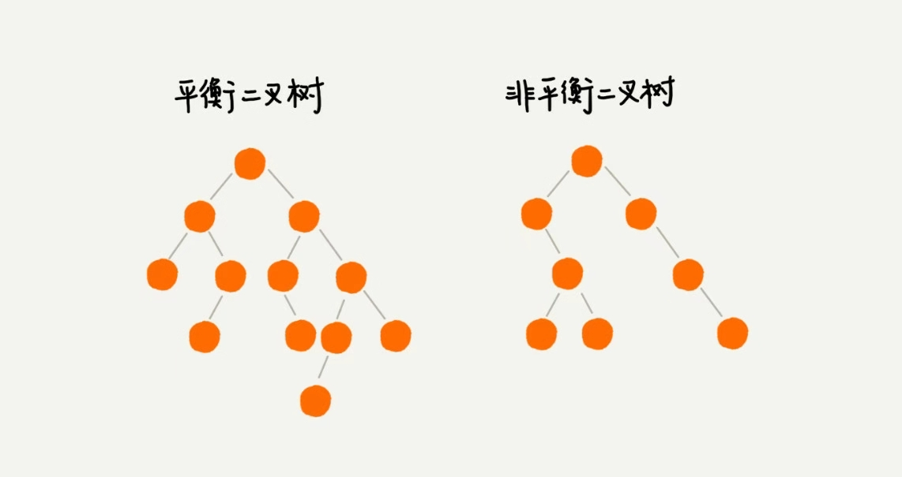
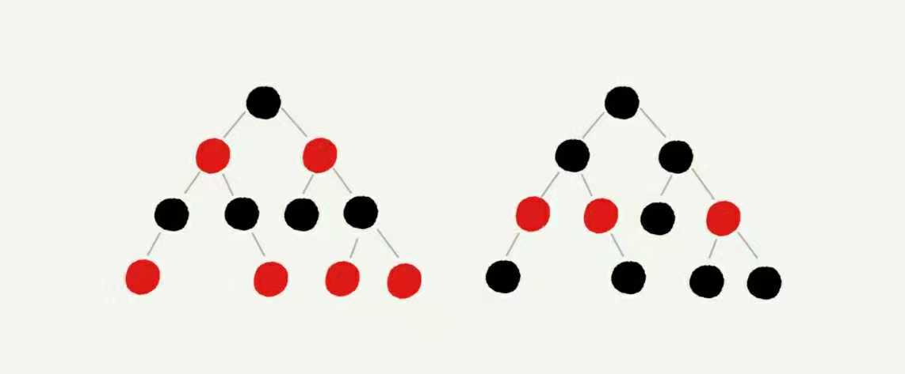
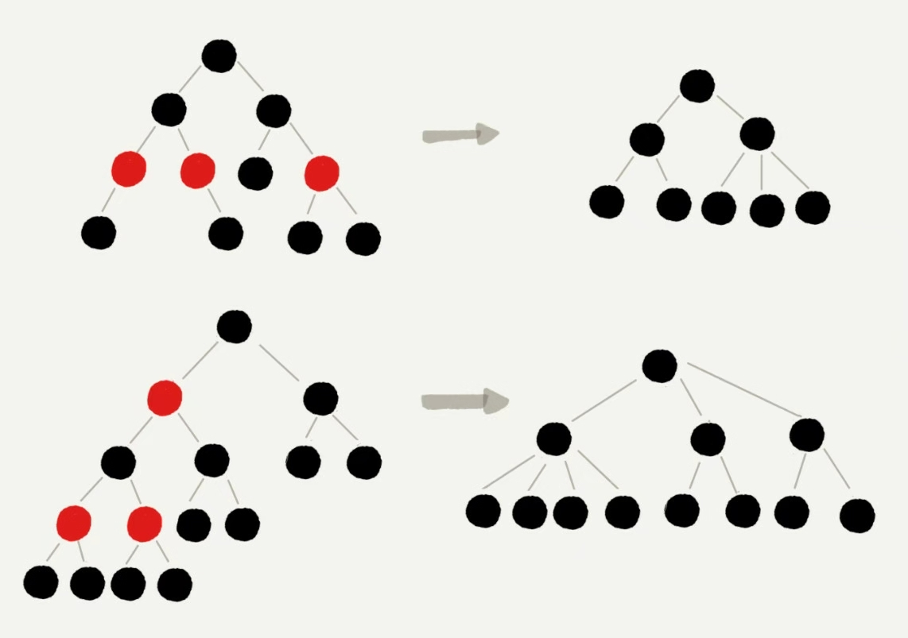

# 为什么都使用红黑树这种二叉树?

## 上一讲中已经讲过了一种很特殊却很常用的树结构, 二叉查找树, 能做到在插入, 删除, 查找的各个操作复杂度为logn, 已经是一种很搞笑的数据结构了, 但是也有一个问题, 在动态更新中会出现树的高度远大于log2n的情况, 会导致各个操作的效率下降. 极端情况下, 如果根节点为最大值, 然后降序排列的话就会退化成链表.时间复杂度会降为O(n). 要解决这个时间复杂度的退化问题需要设计一个更合理的树结构 --- 平衡二叉树, 而红黑树是平衡二叉树中的典型代表

## 什么是平衡二叉树: 任意一个节点的左右子树高度相差不能超过1. 完全二叉树, 满二叉树是一定满足这个要求的.非完全二叉树可能是满足要求.

### 如何避免刚才描述的二叉查找树的效率退化? 使用一个新的结构: 平衡二叉查找树. 

#### 最先被发明的是 AVL 树, 他是完全符合平衡二叉树的定义的, 是高度平衡的二叉树, 查找的效率非常高, 但是AVL为了维持这种平衡需要在插入和删除的时候进行调整, 计算比较复杂和耗时, 所以AVL更适用于插入和删除操作不频繁的数据集合.

#### 很多的平衡二叉查找树并没有严格按照平衡二叉树的定义, 比如红黑树最长路径可能会比最短路径长一倍. 但是如果树的高度仍然是对数的数量级, 尽管不严格符合平衡二叉树, 但也可以视为一个合格的平衡二叉树.

## 如何定义红黑树?

### 平衡二叉树有很多, 比如 Splay Tree(伸展树), Treap(树堆)等,绝大部分的情况下, 操作效率都很高, 但是也无法避免极端情况的时间复杂度退化,  红黑树(Red-Black Tree)是这里边的形象代言人, 他几乎比平衡二叉树更出名.他具有的特点为:

- 根节点是黑色
- 每个叶子节点都是黑色的空节点(NIL), 不储存任何数据
- 任何相邻节点不能同时为红色, 红色节点必须被黑色节点隔开
- 每个节点从该节点到叶子节点的所有路径中, 经过的黑色节点个数相同

下图为省略了叶子空节点的图

### 为什么说红黑树近似平衡?

#### 如果把所有的红色节点都去掉, 那么红黑树会变成一个非二叉树

#### 比如如果出现了四叉树, 可以将四叉树中的某些节点放到叶节点的位置.四叉树就变成了完全二叉树, 所以仅包含黑色节点的四叉树比包含相同个数的完全二叉树的高度还要小,那么如果加上红色节点, 因为红黑树的定义中红色必须间隔黑色, 所以红色节点的高度也不会高于完全二叉树的高度, 两者相加最多也就是 2log2n 的复杂度. 所以红黑树的高度近似于 2log2n, 在性能上损失并不是很多. 这样只是定性的推到, 实际红黑树的性能会更好

红黑树只是近似的平衡, 不是严格平衡, 在维护平衡的成本上校AVL的低, 所以红黑树的插入删除和查找都相对稳定, 能满足工业级的应用.

## 总结以下迄今为止支持插入删除查找操作的动态数据结构的优劣势和应用场景
名称|优势|劣势|应用场景
|---|---|---|---|
|数组|1 连续空间, cpu可缓存   2 查找复杂度为1|1 插入和删除时间复杂度均为n, 且需要额外空间  2 连续空间, 对空间的要求较高|储存变化较小的供查找的数据|
|链表|1 插入, 删除复杂度为1  2 不要求连续空间, 可零散储存|1 不连续, 需要额外的空间储存指针, 且无法被cpu缓存  2 查找的复杂度为n|1 hash表的冲突储存 2 频繁插入删除|
|特殊链表(数组): 队列|-|-|先进先出, 事件响应队列|
|特殊链表(数组): 栈|-|-|后进先出, 函数调用栈|
|哈希表|查找效率非常高|插入,删除复杂度高|分布式缓存, 大量数据的查找|
|红黑树|查找删除插入的效率都很高|效率不是最高, 极端情况下会有退化|工业级的数据集合|