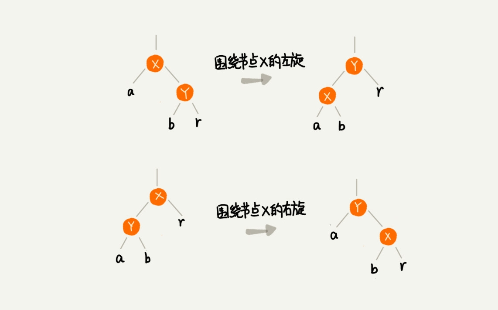
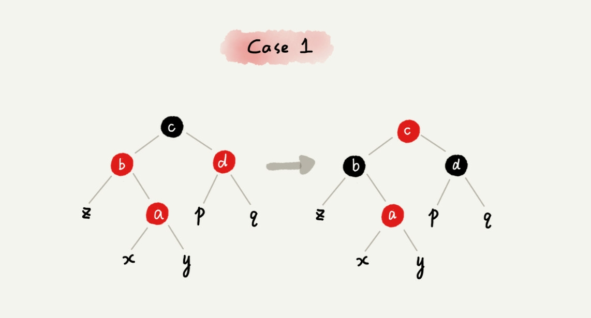
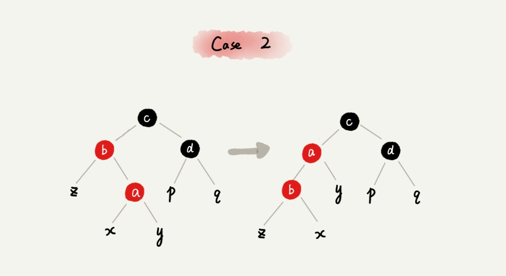
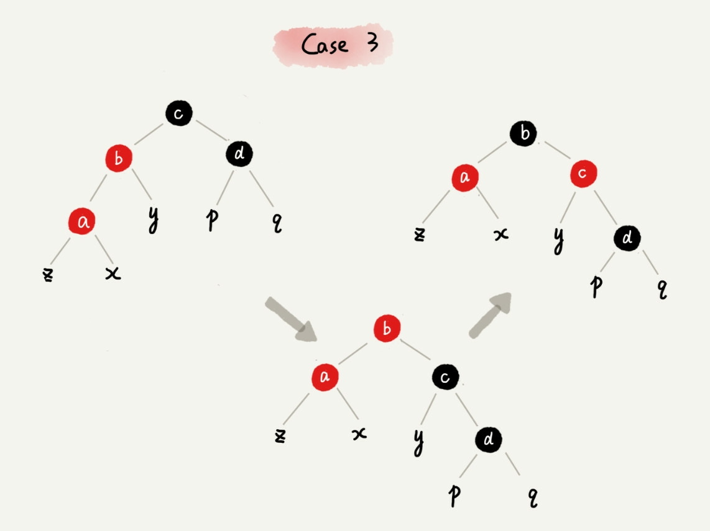
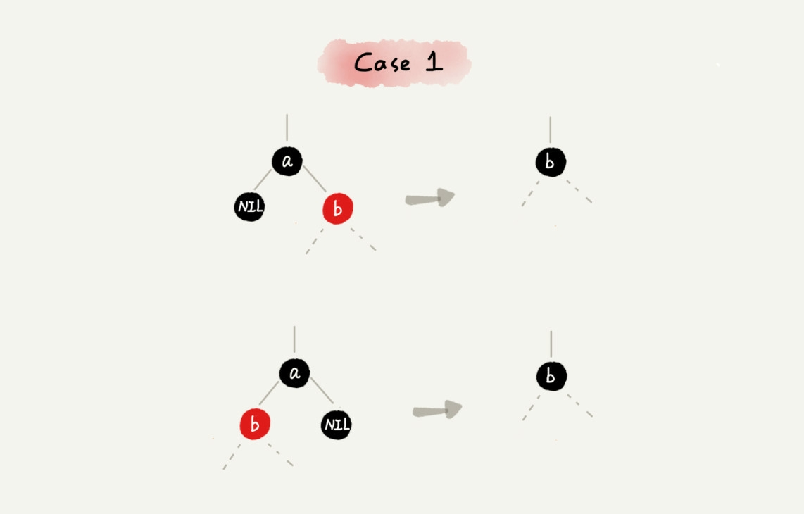
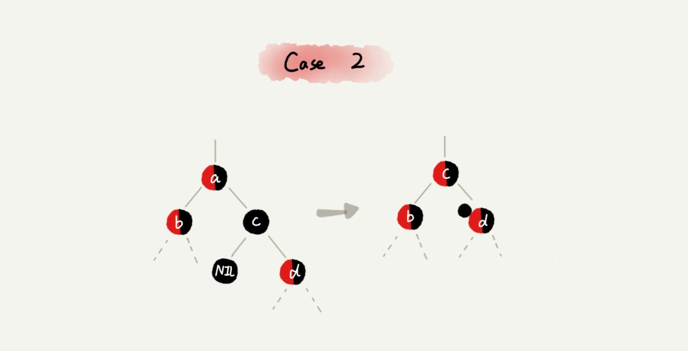
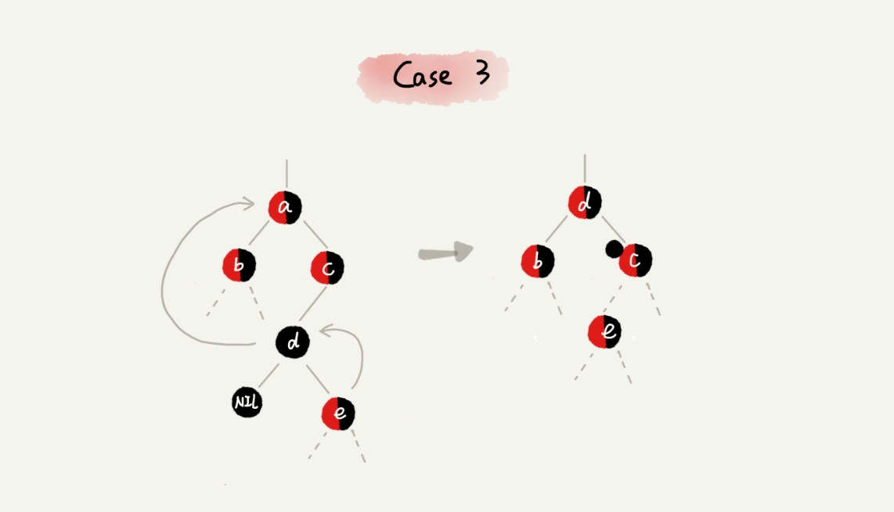

# 如何实现一个红黑树?

## 基本思想:

### 遇到什么样的节点排布, 就对应的去调整. 也就是说必须很熟悉红黑树的各种排布规律, 需要一定的记忆性

### 还记得上一讲说的对红黑树的要求吗?

- 根节点为黑色
- 每个叶子节点都是黑色的空节点( nul )
- 任何相邻的节点不能同时为红色(上下层)
- 每个节点, 从该节点到叶子节点的所有路径包含相同数目的黑色节点

### 两个很重要的操作
- 左旋
- 右旋

## 插入与删除后的再平衡

### 插入

#### 规定: 插入的节点必须是红色的, 二叉查找树中新插入的节点都是放在叶子节点上.
- 如果插入节点的父节点是黑色的, 那么是最理想的情况, 什么都不用做
- 如果插入节点为根节点, 直接改变颜色为黑色即可
除此之外的插入都会不满足红黑树的定义, 调整的过程包含两个, 左右旋和颜色改变.

#### 关注节点: 正在处理的节点, 会随着迭代处理过程不断发生变化. 最开始的关注节点就是新插入的节点

先声明一个定义 **叔叔节点: 父节点的兄弟节点.** 

#### CASE1, 如果关注节点时 a, 叔叔节点为红色

- 关注节点的父节点 b, 叔叔节点 d 都设置为黑色
- 将关注节点 a 的祖父节点 c 的颜色设置为红色
- 关注节点从 a 变成祖父节点 c
- 跳到 CASE2 或 CASE3

#### CASE2, 如果关注节点 a 的叔叔节点 d 为黑色, 关注节点是其父节点b 的右子节点

- 关注节点变成 a 的父节点 b
- 围绕 b 左旋
- 跳到 CASE3

#### CASE3, 如果关注节点是 a, 叔叔节点 d 是黑色, 关注节点 a 是父节点 b 的左子节点

- 围绕关注节点 a 的祖父节点 c 右旋
- 将关注节点 a 的父节点 b, 兄弟节点 c 的颜色互换
- 调整结束

### 删除

#### 删除的情况比插入多.总体来说分为两步: 

- 针对删除节点初步调整, 保证在删除一个节点后仍能保证整棵红黑树满足最后一条的要求.即该节点到任意一个叶子节点经过的所有路径包含相同的黑色节点
- 使满足第三条, 没有两个相邻的红色节点

#### 先看第一步, 保证相同节点
##### CASE1 如果要删除的是节点a, 只有一个子节点 b
- 删除节点a, 并且把节点 b 换到节点 a 上
- 节点 a 只能是黑色, 节点 b 也只能是红色, 其他情况都不满足红黑树的定义
- 将 b 的颜色从红色变成黑色
- 调整结束, 不需要进行二次调整

##### CASE2 如果要删除的节点a 有两个非空 左右子节点分别 b 和 c
- 如果后继节点为c(即c没有左子树)
  - 把 a 删除, 将节点 c 替换到节点 a 的位置
  - 把节点 c 的颜色设置为跟 a 相同的颜色
  - 如果 c 的颜色是黑色, 那么为了不违反红黑树的最后一条, 需要给 c 节点的右子节点 d 多加一个黑色
  - 关注节点变为节点 d, 进行第二步的操作

- 如果后继节点不为 c
  - 找到后继节点 d, 并将它删除, 删除 d 的过程与 CASE1相同
  - 将节点 a 替换成节点 d, 并把 d 的颜色设置为 a 的颜色
  - 如果 d 是黑色, 那么需要在 d 的右叶子节点c添加一个黑色
  - 关注节点变为节点 c

#### 第二步, 保证没有相邻的红色, 为了统一, 将上一步中的关注点命名为a
##### CASE1 如果 a 的兄弟节点 c 是红色
- 