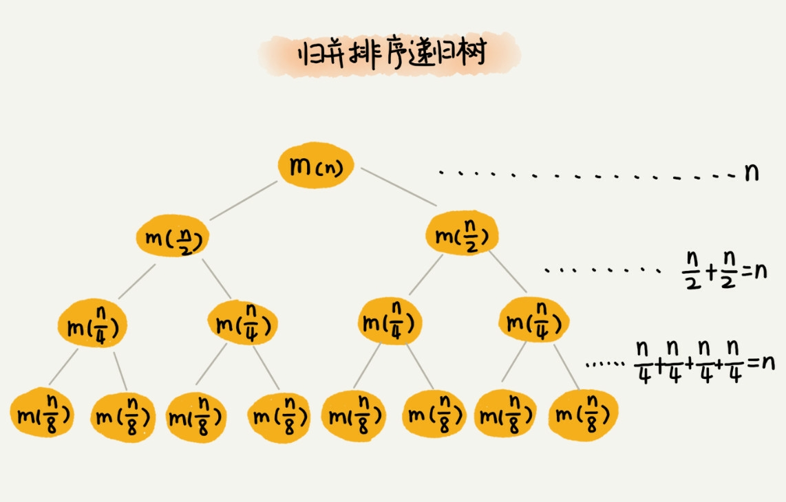
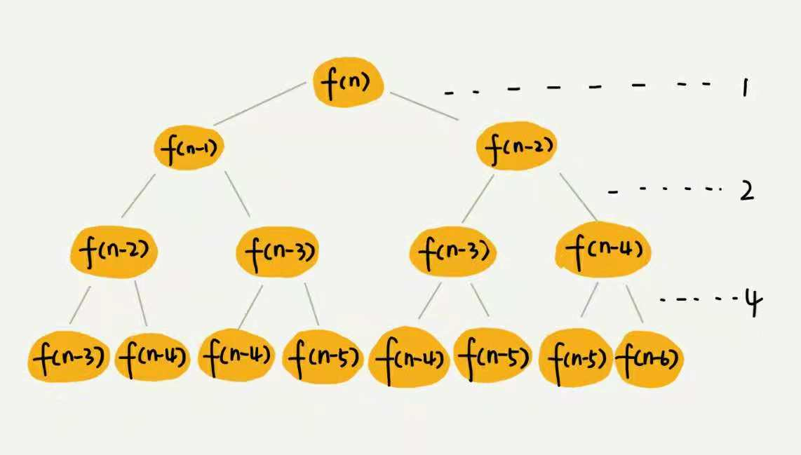
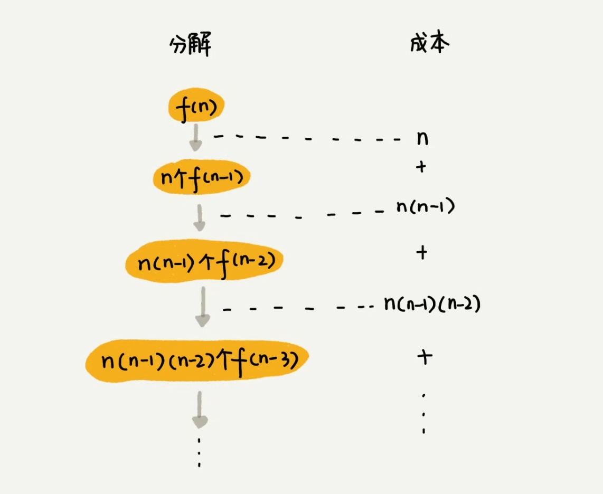

# 之前有讲递归的时候分析过递归的复杂度, 如果用数学公式进行推导是比较复杂的. 如果借助树的结构(树也是从根节点到叶子节点的分解过程)来分析, 就会直观和简单很多

## 上图是斐波拉契数列的分解求解过程, 一个节点的求解可以被分解为左右节点的求解.

## 上图为归并排序的分解过程, 如果假设每一次的分解所消耗的时间即为常量1, 归并操作消耗的时间即为 n, 现在只需要知道这个树的高度即可得到总的复杂度为 O(n*h), 归并排序的归并树为满二叉树, 满二叉树的高度大约为 log2n, 所以归并排序的复杂度大致为 O(nlogn), 这样分析的下来比使用递推公式直观很多.

## 实战1: 分析快排的复杂度

快排在最好情况下是每次分区都可以一分为二, 所以使用递推公式(这里使用 +n 是因为有一次数据的遍历) `T(n) = 2T(n/2) + n`, 这样可以推导出复杂度为 O(nlogn), 但是如果是不理想的情况, 每次分区不能一分为二, 如果分的比例是1:9, 那么递推公式为 `T(n) = T(n/10) + T(9*n/10) + n`, 下面看一下用树的方式来求解复杂度, 会比这样用递推公式好看很多.

每次分叉都会有一次遍历, 每一次遍历的复杂度为n(pivot 左和pivot右), 现在需要求的就是树的高度, 因为叶子节点肯定为1, 所以就是从n降到1的过程, 所以有最长路径 log10/9n 和最短路径 log10n, 所以整体的复杂度就是:
log10n * n <= O <= log10/9n

去掉常数项, 所以可以表示为O(nlogn), 这样的分析是不是就比使用递推公式要好很多呢? 当然, 每次的最短路径和最长路径是不确定的, 但是从概率论上来说, 都会确定出一个常数项, 只是大小不同而已

## 实战二:分析费波拉契数列的复杂度

如果要按照递推公式去推算是比较复杂的, 因为

首先分析每一层: 从1,2,4,8可以得到是从2^0, 2^1, 2^2,...2^n, 然后再看看树的高度, 最长的为n, 最短的为n/2, 那么整个复杂度就在 1+2+2^2,...2^(n/2-1),到1+2+2^2,...+2^(n-1), 等比数列, 都不用想, 是指数级的复杂度, 相当高的, 即使对数据进行了储存, 可以避免部分的重算, 但是也只能降低1/2而已, 还是指数级. 约在2^(n/2)-1 到 2^n-1 之间.

## 实战三:分析全排列的复杂度.

什么是全排列, 比如1,2,3三个数有多少种组合方式? 
- 1,2,3
- 1,3,2
- 2,1,3
- 2,3,1
- 3,1,2
- 3,2,1
共 3! = 6种, 那么如何用编程来打印这些组合方式呢?

如果确定了第n位, 那么就变成了求解前面的n-1位的问题. f(n) = n*f(n-1)

所以整个复杂度加起来为:

`n+n(n-1)+n(n-1)(n-2)+n(n-1)(n-2)(n-3).....+n(n-1)(n-2)..*2*1`
也可以看出整个的复杂度大于n! 小于n*n!.那也是非常大的复杂度.

## 思考: 一个细胞生命周期为3个小时, 每个小时可以分裂一次, 求n个小时之后的细胞数?这个递归问题的复杂度是多少?

