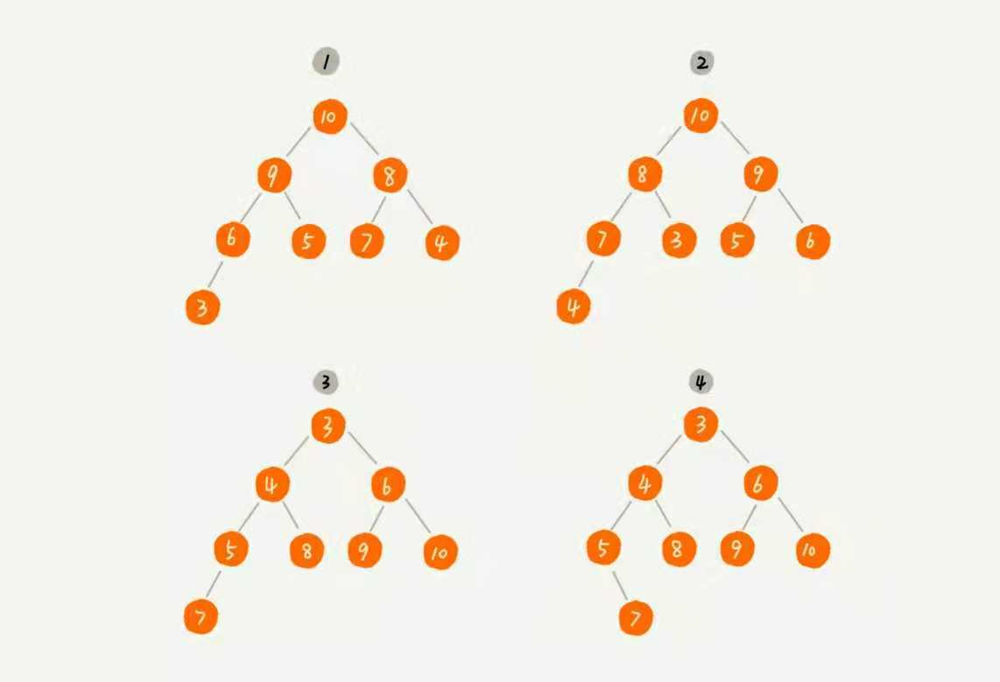
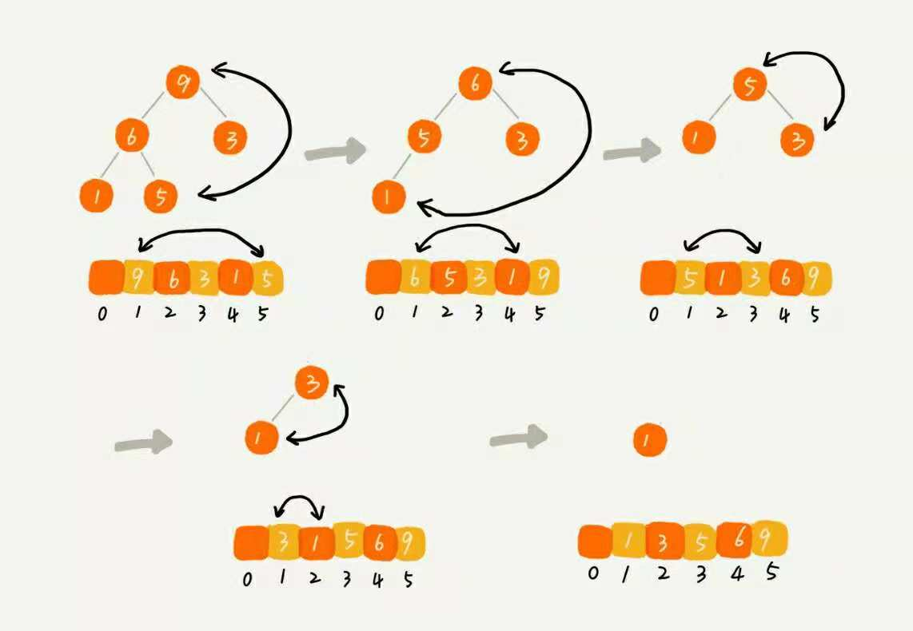

# 今天讲一个特殊的树结构, 堆.

## 堆的特殊之处在于:

- 是一个完全二叉树
- 每一个节点大于等于(或小于等于)它的父节点, 都小于等于(或大于等于)它的子节点, 前者称为小顶堆, 后者称为大顶堆

## 因为是完全二叉树的缘故, 堆可以用数组来高效的表示.



## 来看看堆的数据插入和删除的复杂度(假设是大顶堆)

### 数据插入

- 先将数据插入到数组末尾, 也就是叶子节点的依次添加
- 与父节点进行递归比较, 如果子节点大于父节点则交换位置(也叫堆化的过程)

注意, 堆的排列规则是有一定的顺序的. 最后一个叶子节点的父节点的索引一定是 n整除2的值, 如果刚好整除则证明叶子节点为左子节点, 如果有余数为右子节点. 但是在代码中并不需要关心是左还是右节点, 只是这样更便于理解.


```js
const heap = []
function  heapify(heap, current_node_index) {
  let parent_node_index = parseInt(current_node_index / 2)
  while(heap[parent_node_index] < heap[current_node_index]) {
    [heap[parent_node_index], heap[current_node_index]] = [heap[current_node_inde],heap[parent_node_index]]
    current_node_index = parent_node_index
    parent_node_index = parseInt(current_node_index / 2);
  }
  return heap;
}
function insert_heap(node) {
  let parent_node_index = parseInt(heap.length / 2);
  // 先插入
  let current_node_index = heap.length;
  heap[current_node_index] = node;
  // 堆化
  return heapify(heap,current_node_index)
}
```

### 数据删除

- 用最后一个节点跟待删除的节点进行交换
- 通过堆化的过程来使树保持一致

```js
function delete_heap(node_index) {
  let current_node_index = heap.length - 1;
  [heap[node_index], heap[current_node_index]] = [heap[current_node_index], heap[node_index]];
  // 删除最后一个
  heap.pop();
  // 堆化
  return heapify(heap, node_index)
}
```
### 下面看看这两种操作的时间复杂度

#### 一个包含 n 个节点的完全二叉树, 高度不会超过 log<sub>2</sub>n, 堆化的过程跟节点的高度有关, 也就是 O(logn), 插入和删除的主要逻辑便是堆化, 所以复杂度都是 O(logn)

## 堆排序

### 堆排序的思想其实很简单, 有两个部分构成, 建堆和对堆进行排序

#### 建堆


- 叶子节点不需要比较, 所以从最后一个有子节点的节点开始, 即last_index = current_index = parseInt(heap.length / 2)
- 比较左右子节点, 如果小于其中任何一个需交换位置, 并在交换位置后如果不是last_index, 继续递归比较
- current_index -= 1, 
- 如果curren_index = 1,则堆化完成, 否则继续递归.

```js
function heapify_down(heap, current_index) {
  let n = heap.length
  while (heap[current_index] < heap[2*current_index] || heap[current_index] < heap[2*current_index + 1]) {
    let max_pos;
    if(current_index*2 <=n && heap[current_index] < heap[2*current_index]) {
      [heap[current_index], heap[2*current_index]] = [heap[2*current_index], heap[current_index]]
      max_pos = current_index * 2
    }
    if (current_index*2+1 <=n && heap[current_index] < heap[2*current_index+1]) {
      [heap[current_index], heap[2*current_index] + 1] = [heap[2*current_index + 1], heap[current_index]]
      max_pox = current_index * 2 + 1
    }
    current_index = max_pos
  }
}
function heapify(heap) {
  let current_index = last_index = parseInt(heap.length / 2);
  while(current_index >= 1) {
    heapify_down(heap, current_index);
    current_index -= 1
  }
}
```
#### 对堆排序
- 根节点与最后一个叶子节点交换
- 除了最后一个叶子节点之外进行堆化
- 如果是大顶堆便是从大到小排序, 小顶堆反之为从小到大排序



```js
function heap_sort(heap) {
  let current_last_index = heap.length - 1;
  while(current_last_index >= 1) {
    [heap[0], heap[current_last_index]] = [heap[current_last_index], heap[0]]
    current_last_index -= 1
    heapify(heap.slice(0, current_last_index))
  }
}
```
#### 堆排序的复杂度

成堆的过程复杂度是O(log(n)), 排序的过程要遍历n个元素, 所以排序的复杂是O(n * log(n)), 整个堆排的复杂度为O(n * log(n))

下面用树结构来分析一下为什么成堆复杂度是log(n)具体的复杂度.


可以看到复杂度为: `O = 1*h + 2^1 * (h-1)... + 2^k * (h-k)...+ 2^(h-1)*1`两边同时乘以2, 再相减得: `O = 2+2^2+...2^(h-1)+2^h - h = `, 将 h=log<sub>2<sub>n代入, 得 O = 2*n - 2 - log<sub>2<sub>n.

## 但是为什么堆排序没有快排好呢?

### 堆排序的优点 
- 原地排序, 只需要极少数的临时空间储存
- 空间复杂度稳定, O(nlogn)

### 堆排序的缺点
- 不是稳定排序, 因为要交换, 无法保证原顺序不变, 当然可以进行判断, 当最后一个叶子结点的值与堆顶相同时不进行交换, 继续向上一个叶子节点比较.
- 堆排序的访问方式是以2的阶乘倍访问, 不是连续访问, 对cpu的缓存利用效率低
- 对于同样的数据, 排序过程中, 堆排序的数据交换次数要高于快排.因为建堆的过程会将原有序的数据给打乱.比如


注意: 如果要充分利用数组, 把数组的0索引也利用的话, 则需要依次进行添加, 公式会略有差异, 需要加一.