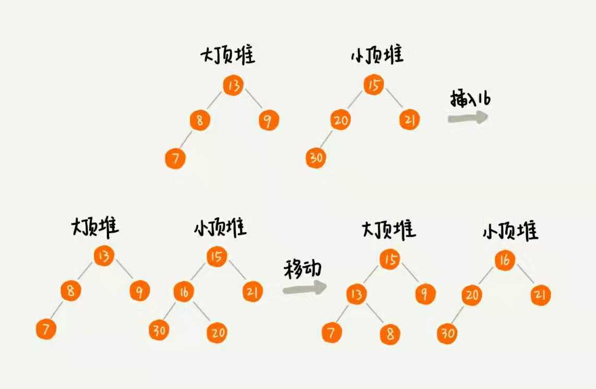

# 堆在很多地方都有着非常重要的作用

- 优先级队列
- 求Top K
- 求中位数

## 优先级队列

### 队列是先进先出, 但是某些情况下需要实现一个具有权重的队列. 有个优先级, 优先级高的先出队. 比如你跟一个漂亮女士去排队, 你先排的, 但是刚好是妇女节, 体现绅士风度, 女士的优先级就比你高了, 她就排前面去了.

### 用堆是实现优先级队列最好的方式, 最高效也最直接.因为堆本来就可以被看作一个优先级队列, 只要定义好比较的权重大小, 往优先级队列中插入一个元素跟在堆中插入元素没有什么区别.

### 实例: 合并有序小文件
假设有100个小文件, 每个文件的大小都是100MB, 每个文件储存的都是有序的字符串, 希望将这100个小文件合并成一个有序的大文件.这就可以用优先队列了.

- 生成一个大小为100的小顶堆, 每个元素为这100个小文件的第一个字符串
- 将堆顶元素放入代合并的文件中, 并删除堆顶元素
- 将删除元素对应文件的第一个字符串再插入到堆中
- 进行堆化
- 重复第二个操作

#### 分析下复杂度: 插入和删除都是O(logn), 所以整个的复杂度为O(log100), 比数组高效很多.

### 实例: 高性能定时器

假设又一个定时器维护了很多定时任务, 每个任务有触发的时间点, 那么就需要每过1s就扫描一边定时器列表, 看有无需要执行的任务.这样会有两个问题:

- 1 如果最近的定时器距离当前时间都还很远, 完全没必要去扫描的
- 2 如果定时器任务很多, 那么会消耗很多的时间去进行扫描

如果使用定时器, 以定时器任务的执行时间的大小建立小顶堆, 假设堆顶元素的时间为T, 那么在T-1的时间范围中不需要定时器执行任何事情, 等到时间为T时, 将事件执行并从堆顶删除, 重新堆化. 当然可以提高精度, 可以把之前的1替换成0.00000001;

## TOP K

### Top K有很多种求法, 但是复杂度比较高, 因为排序的复杂度高, 现在看看堆的表现呢?

#### 如果是静态数据集合

- 维护一个大小为K的小顶堆, 遍历整个数组,如果比堆顶元素大, 则将堆顶元素删除, 然后插入该数组元素并进行堆化
- 当数组遍历完毕之后就自然成为 top K数据, 再依次从堆顶输出即可.

时间复杂度为: 一次堆化为 O(logK), 假设最坏的情况每次遍历的元素都进行了堆化, 则n
个元素的堆化为 O(nlogK).

#### 如果是动态的数据

每次查询, 都基于当前数据重新计算的话, 那么复杂度就为刚刚所说的 O(nlogk), 但是可以一直维护一个 K 的堆, 每次添加的时候都进行对比, 这样在查询的时候可以立即给出去.根据复杂度均摊法则, 会低很多.

## 利用堆求中位数

### 本质就是维护两个堆, 数量为一人一半, 一个大顶堆, 一个小顶堆, 且小顶堆的数据都大于大顶堆的, 那么大顶堆的堆顶元素即为中位数, 此时大顶堆的元素数量为 n/2 + 1(也可以大顶堆的数据都大于小顶堆, 那么小顶堆的堆顶元素即为中位数, 小顶堆的元素数量为 n/2+1 , 两者是对应的)

### 如果数据是动态的呢?
当新添加一个数据的时候, 先比较是否大于大顶堆的堆顶元素, 如果大于, 则将数据插入到小顶堆中, 然后肯定会出现大顶堆和小顶堆的元素数量不符合之前定义的情况, 此时只需要将两个堆中多的堆的堆顶元素进行删除并插入到另一个的堆中. 保持 n/2 的数量限制

插入和删除时间复杂度为 logn, 要得中位数直接返回堆顶元素, 复杂度为 O(1), 所以, 整个的复杂度为 O(logn)

### 同理, 如果要求接口请求中第99%的响应时间呢? 只需要对数量划分进行区别, 即大顶堆中保存99%*n, 小顶堆保存1%*n

## 如果有10亿个搜索关键词, 如何快速获取 top 10的关键词呢? 内存限制为1GB, 场景为单机, 即不能用分布式.

可以用 hash 表储存这些数据但是内存有所限制, 假设每个关键词的长度为50个字节, 10亿个数据中不重复的数据有1亿条, 那么整个需要5GB 的空间, 而且还要考虑hash 表的装载因子以解决冲突, 所以直接放不符合要求, 可以采用分片式.存编号为01,02,...,09,10的10个文件中, 每个文件大小为1GB, 然后分别在这10个文件构建 K=10的堆, 按照之前说的方法求出10个 topK 的堆, 最后再将这10个进行合并排序即可.

复杂度分析: 遍历, 需要 O(n), 插入和删除需要 O(logK), 所以总的复杂度为 O(n*logK), 如果是动态的, 还可以把遍历的时间给均摊掉, 是一种比较高效的办法.

