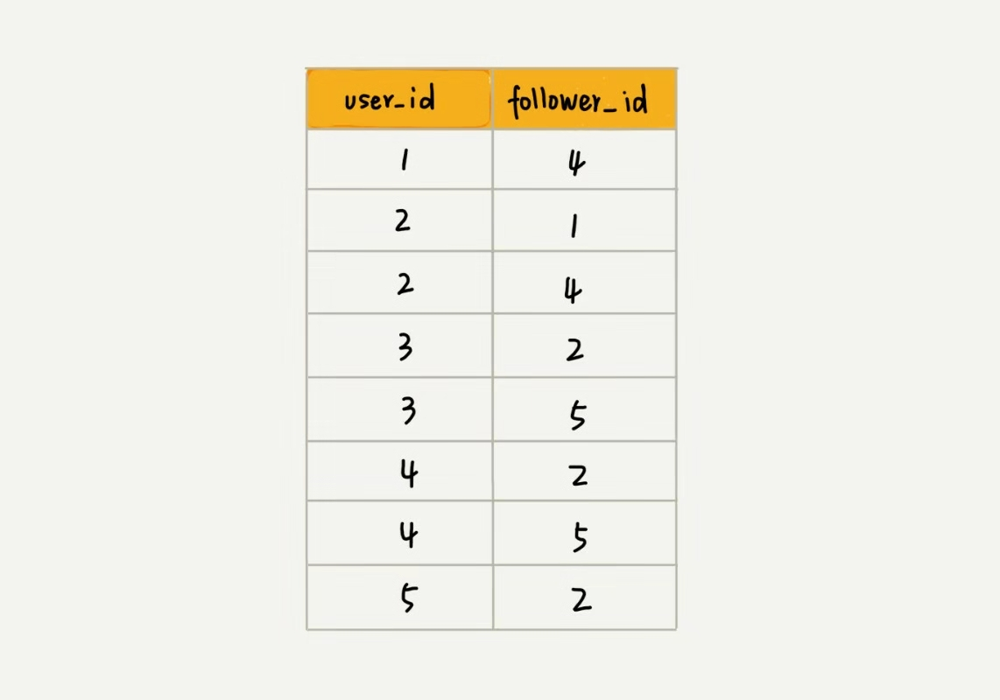

# 图(Graph), 一种根树一样的非线性表结构, 比树更加的复杂

图这种结构涉及的算法会非常的多
- 搜索
- 最短路径
- 最小生成树
- 二分图

这一讲主要集中在**图的储存**这一方面.

## 顶点(Vertex)

在树中 每一个元素被叫做节点, 在图中, 每一个元素被叫做**顶点**, 图中的每一个顶点之间的连接关系被称为**边(edge)**.

生活中有很多符合这个结构的例子, 比如社交网络中的好友关系, 粉丝关系.

### 先拿微信举个例子

每个用户看出一个顶点, 如果两个用户互加好友, 那么就在两者之间建立一条边, 每个用户有多少个好友就统计这个顶点的边有多少条, 也就是图中**度(degree)**的概念.

粉丝跟微信的关系还不一样, 粉丝支持单向的粉, 而好友如果不是互加的话这个链接是建立不起来的.假设用户A关注了用户B但是B并没有关注A, 这在粉丝关系中非常常见, 于是**边**就有了方向性, 所以图可以大致的分为"有向图"和"无向图".

指向一个顶点的被成为 **入度(in-degree)**, 从一个顶点指向外的被成为 **出度(out-degree)**

### QQ好友关系亲密度

除了有连接关系之外, QQ好友还有亲密度的功能(不知道你跟多少已经是友谊的巨轮了呢?), 如果经常联系, 亲密度就会增加, 那么这个应该如何表示呢? 这里就是另一种图: **带权图(weighted graph)**, 在带权图中, 每条边都有一个 **权重(weight)**

图的分类大致就这么几种, 但是如何在内存中使用图这一种数据结构呢?

## 邻接矩阵储存法(Adjacency Matrix)

底层其实就是一个二维数组, 对于无向图, 如果i和j之间有关系, 那么**A[i][j]和A[j][i]**都会是1, 对于有向图, 如果i出度到j入度, j没有出度到i, 那么 **A[i][j]=1 A[j][i]=0**

邻接矩阵表示法虽然直观, 简单, 而且获取两个顶点的关系时的复杂度为1, 而且还可以使用矩阵的运算, 比如求最短路径(Floyd-Warshall) 但是浪费空间
1. 对于无向图来说, A[i][j]=1那么一定可以推导出A[j][i]=1, 浪费了一半的空间储存无用的数据. 
2. 对于稀疏图(Sparse Matrix, 顶点很多, 每个顶点的边不多), 比如微信用户一共有好几亿, 但是每个用户最多只有几百个好友, 那么绝大部分的储存空间都浪费了.

## 邻接表储存(Adjacency List)

有点像散列表, 每个顶点对应一条链表, 储存着与这个顶点相连接的其他顶点.下图时有向图的邻接表, 无向图更简单, 储存的都是通过边相连的顶点

邻接表虽然比较节省空间了, 但是相对的, 查找起来就费时了.因为要去查找链表, 复杂度为O(n), 当然可以用更高效的查找方式, 比如跳表, 红黑树, 或者再一个散列表, 当然还可以使用有序动态数组, 二分查找的方式快速定位.

## 图的操作方法
### 以粉丝关系的有向图为例
- 判断用户A是否关注了用户B
- 判断用户B是否关注了用户A
- 用户A关注用户B
- 用户A取消关注用户B
- 根据用户名称首字母排序, 分页获取粉丝列表
- 根据用户名称首字母排序, 分页获取关注列表

不过用一个邻接表储存有向图是不够的, 因为可以很简单的知道顶点A关注了哪些用户, 但是要查找被哪些用户关注是比较困难的.所以我们需要一个 **逆向邻接表**,要查找被哪些人关注, 就从逆邻接表查.

基础的邻接表因为链表查找复杂度问题不适合, 所以考虑哪一种呢? 因为需要 **分页**, 就是这个分页功能, 如果采用 **跳表** 的话是天然具有分页的能力. 跳表的事件复杂度为O(logn), 空间复杂度为O(n), 虽然空间复杂度高, 但是再获取粉丝列表和关注列表的时候就根本不需要排序了, 直接可以从跳表中获取.

再综合一下, 如果是小规模的数据可以放进内存是没有问题的, 但是如果是类似微博那样的上亿级的数据, 放内存就不现实了, 这时候可以像对哈希表做的操作那样进行分片, 在不同的机器上储存邻接表.

还有一种当然就是使用关系型数据库了, 建立两列索引, 分别储存user_id和follower_id, 然后通过SQL语句获取

# 总结下图的特性:

1. 无向图
    1. 边
    2. 顶点
2. 有向图
    1. 度
        1. 入度
        2. 出度
3. 带权图
    1. 权重
4. 储存方式
    1. 邻接矩阵
        1. 二维数组
        2. 浪费空间
        3. 直接获取关系
    2. 邻接表
        1. 分片
        2. 跳表(分页)
        3. 红黑树, 有序数组, 散列表

