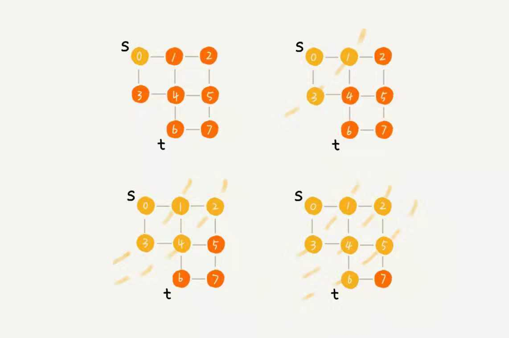

# 抛出问题
还记得六度分割理论吗?如果现在给一个用户, 如何求出它3度里面的好友数(包括一度和二度)?

其实本质就是图的搜索, 图的搜索分两种, 一种广度优先搜索, 一种深度优先搜索, 而且针对的都是无向图.

首先实现一个无向图
```js
class LinkedList {
    private lastNode;
    private headNode;
    constructor() {
        lastNode = null
        headNode = null
    }
    public add(value) {
        if (!lastNode && !headNode) {
            lastNode = headNode = {value}
        } else {
            if (lastNode === headNode) {
                headNode.next = {value}
            }
            lastNode.next = {value}
        }
    }
    public get(value) {
        const node = headNode
        while (node) {
            if (node.value === value) {
                return node
            } else {
                node = node.next
            }
        }
    }
}
class Graph {
    private v:number;
    private adj:LinkedList[];
    public constructor (v:number){
        this.v = v
        this.adj = new LinkedList()
        for (let i = 0; i < v; i ++) {
            this.adj.add(i)
        }
    }
    // 构建两条边
    public addEdge(s, t) {

        this.adj.get(s).edge ? this.adj.get(s).edge.push(t) : this.adj.get(s).edge = [t]
        this.adj.get(t).edge ? this.adj.get(t).edge.push(s) : this.adj.get(t).edge = [s]
    }
}
```

# 广度优先搜索(BFS: Breadth-First-Search)

像这样地毯式搜索



下面看看具体的代码实现, s为起点, t为终点.搜索一条从s到t的路径, 实际上, 就是最短路径了.

```js
// 以下代码包含在Graph类中
function bfs(s, f) {
    if (s === f) return;
    let visited,prev = new Array(v);
    for (let i = 0; i < v; i ++) {
        visited[i] = false;
        prev[i] = -1
    }
    visited[s] = true;
    let queue = [];
    queue.push(s)
    while (queue.length !== 0) {
        const w = queue.pop()
        for (let j = 0; j < w.edge.length; j ++){
            queue.push(w.edge[j])
        }
    }

}