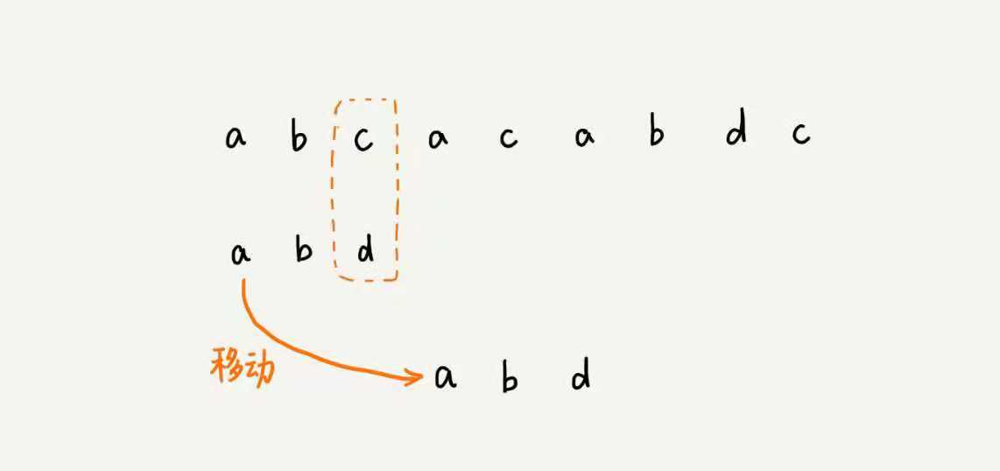

上一节说了比较粗暴的 BF 和 RK 算法, 这次看看需要一些技巧的字符串匹配算法.

# 查找功能
假设有个文本编辑器, 需要添加一个查找的功能, 比如 word 中的查找, 应该如何实现? 之前说的 BF 和 RK 也可以实现, 但是复杂度比较高, 而且 RK 需要用 hash 表, 设计一个可以适用任意数据类型的 hash 表并不容易. 

## BM(Boyer-Moore)算法

核心思想跟 BF 和 RK 算法一样, 都是把主串和模式串匹配的过程看成模式串在主串中不停的向后滑动, 不过 BF 和 RK 遇到不匹配的时候就往后滑1位, BM 则滑动不止一位:


因为字母 c 在模式串中并不存在, 所以可以直接将模式串移动到 c 后面, 即:



BM算法实质上就是在找当不匹配时应该滑动多少位的规律, 在不忽略正确匹配的情况下滑动最远, 减少匹配的次数.

包含两个部分:

- 坏字符规则( bad character rule)
- 好后缀规则(good suffix shift)

## 坏字符规则


BM的匹配顺序比较特殊,是从后往前匹配.当出现不匹配的字符的时候把这个字符称为 **坏字符**, 比如上图中的 c
拿坏字符在模式串中查找, 发现模式串中并没有, 所以可以直接将模式串移到 c 后.
那如果是模式串中有这个坏字符的话, 就比如移到 c 后的匹配过程, 就需要将模式串中第一个匹配到坏字符的位置进行对齐(注意有多个坏字符的情况, 是以第一个匹配的, 也就是模式串中位置靠后的字符).


所以规律来了:

坏字符对应模式串在主串的下标记为 si, 把在模式串的下标记为 xi, 如果没有匹配 xi 为 -1, 那么下一步模式串移动到 `si - xi`, 最好情况的复杂度十分的低, 是 O(n/m), 比如aaabaaabaaabaaab,使用 aaaa 去匹配, 每次匹配都会往后移4位. 但是也有问题, 比如 aaaaaaaaa, 用 baaa 匹配, 如果使用 si-xi 的公式, 会把模式串前移了.

## 好前缀规则
跟坏字符规则很类似


比如上图中的情况, 发生了多个字符匹配, 应该怎么滑动模式串呢? 把 bc 叫作好后缀, 记作{u} 拿它在模式串中查找, 如果找到了另一个相匹配的自传{u*}, 那就将模式串滑动子串{u*}到主串中{u}对齐的位置.


如果找不到, 则直接将模式串滑动到主串中{u}的后面, 


但是这里是有过度滑动的, 因为多滑了一个 c


所以不仅要考虑后缀子串, 还需要后缀子串的子串去匹配,即假设后缀子串{u}中有子串{v}, 是可以匹配模式子串的前缀子串的, 那应该跟 v 对齐


所以滑动的位数应该是取这两种规则的最大值. 这样也避免了坏字符规则会产生负数的情况.

## 代码实现

先实现坏字符规则, 且不出现负数的情况.

```js
function init(target) {
  // 生成字符 Hash表
  const SIZE = 256
  const hash_character = {}

  for (const i = 0; i < SIZE; i ++) {
    hash_character[i] = -1
  }

  // 遍历模式串
  const l = target.length()
  for (const i = 0; i < l; i ++) {
    hash_character[target[i]] = i
  }
  return hash_character;
}


function start(target, origin) {
  const m = target.length
  const n = origin.length
  const hc = init(target)
  // 首字符对其
  let i = 0;
  while( i< n - m) {
      let j = m - 1
      for (; j >= 0; j --) {
          if (target[j] !== origin(i + j)) {
              break
          }
      }
      // 匹配成功
      if (j < 0) {
          return i
      }
      // 向后移动的距离, 从之前的hc表中找
      i = i + hc[origin[i + j]]
  }
  // 没有匹配到
  return -1
}
```
好后缀规则稍微复杂一点
- 模式串中, 查找好后缀匹配的另一个字串
- 后缀字串的最长能跟前缀字串匹配的后缀字串
**如何表示模式串中的不同后缀字串?**

因为后缀字串中最后一个字符的位置是固定的, 下标为 m - 1, 只需要记录长度就可以了.

**引入最关键的变量 suffix 数组**, 数组的下标k表示后缀字串的长度, 下标对应的数组值储存的是在模式串中跟好后缀{u}相匹配的字串{u*}的起始下标.


如果有多个跟好后缀匹配, 需要使用后面那个, 避免滑过了头. 但是仅仅知道匹配的下标是不够的, 因为还要后缀字串中查找最长的能跟模式串前缀字串匹配, 也就是需要一个prefix数组


**如何计算这两个数组的值?**


