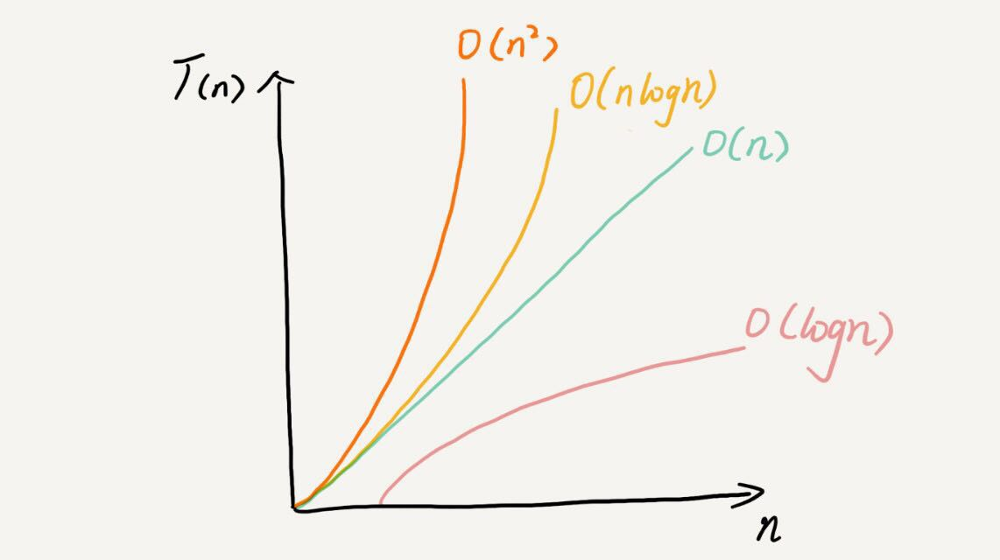

# 第三讲 时间复杂度和空间复杂度的介绍

## 时间复杂度用来衡量程序所需要的时间, 空间复杂度用来衡量程序所消耗的储存大小, 通常情况下时间复杂度更能直观反映算法的好坏, 甚至还有空间换时间的说法.

## 为什么不使用实际运行代码的时间和内存大小来衡量?

1 运行代码的环境不一样, i9 和 i3的速度肯定有所不同

2 测试数据的规模, 100个数据和100的100次方个数据所花的时间肯定不一样, 某些算法在小规模数据上具有优势(比如插入排序之与快排), 而实实在在的跑100的100次方个数据不够现实.

3 不可能先把各种复杂度都写出来测试后再修改, 这样十分的耗费时间,且低效, 需要一个可以在设计代码阶段就让你知道你的算法好不好的衡量指标

## 大 O 表示法
### 请看下面代码
```js
function calc(n) {
  let sum = 0;
  let i = 0;
  for (;i < n; i ++) {
    sum += i;
  }
  return sum;
}
```
假设执行一个运算的时间为单位时间: unit_time,
上述函数第一二行语句需要2个单位时间, for 循环需要 n 个, 每次循环需要使用判断(<) 加一, 和 sum+ ,所以整体运算所花费的时间为:**2 + 3n** 个单位时间, 大 O 表示为 O(n)
```js
function calc(n) {
  let sum = 0;
  let i = 1;
  let j = 1
  for (;i < n; i ++) {
    for (;j < n; j ++) {
      sum += i * j;
    }
  }
  return sum;
}
```
前三行为3个单位时间, 分析两个 for 循环, (2 + (4*n))*n = **4n<sup>2</sup> + 2n** 大 O 表示为 O(n<sup>2</sup>)

## 通常情况下, 只看算法的最高阶, 因为最高阶最能反映数据的量变化时的时间变化快慢程度.

常见的时间复杂度有:


可分为两类:
- 多项式量级
- 非多项式量级, 只有两个 O(n!) O(2<sup>n<sup>), 把非多项式量级算法成为 NP(Non-Deterministic Polynomial) 非确定问题.

O(n)和 O(n<sup>2</sup>)已经在上面举出示例, 现对剩下的几种举例说明

### O(1)
```js
function calc(n) {
  const a = 1;
  const b = 2;
  return a + b + n;
}
```
### O(logn)
```js
function calc(n) {
  let i = 1
  while(i < n) {
    i *= 2
  }
}
```
注意, 这里的 log 没有任何的底数, 因为 log<sub>5</sub>n = log<sub>5</sub>2 * log<sub>2</sub>n, log<sub>5</sub>2为一个常数, 所以这里直接用没有底数的 log 表示.

### O(nlogn)
归并排序, 快排的复杂度就是 nlogn

### O(m + n)

```js
function calc(n, m) {
  sum = 0;
  for (i = 0; i < n; i ++) {
    sum += i
  }
  for ( j = 0; j < n; j ++) {
    sum += j
  }
}
```
### O(m * n) = O(m) * O(n)
```js
function calc(n, m) {
  sum = 0;
  for (i = 0; i < n; i ++) {
    sum += i
    for ( j = 0; j < n; j ++) {
      sum += j
    }
  }
}
```

## 空间复杂度要比时间复杂度简单很多, 只需要看使用的数据类型即可
```js
function calc(n) {
  const a = new Array(n);
  for (i = 0; i < n; i ++) {
    a[i] = n
  }
}
```
只开辟了一个为n 的数据空间, 所以空间复杂度为 O(n)

空间复杂度常见的只有 O(1) O(n) O(n<sup>2<sup>)

## 图表总结

