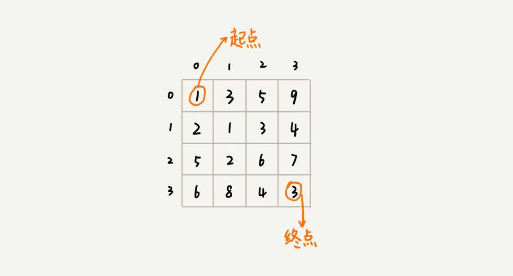
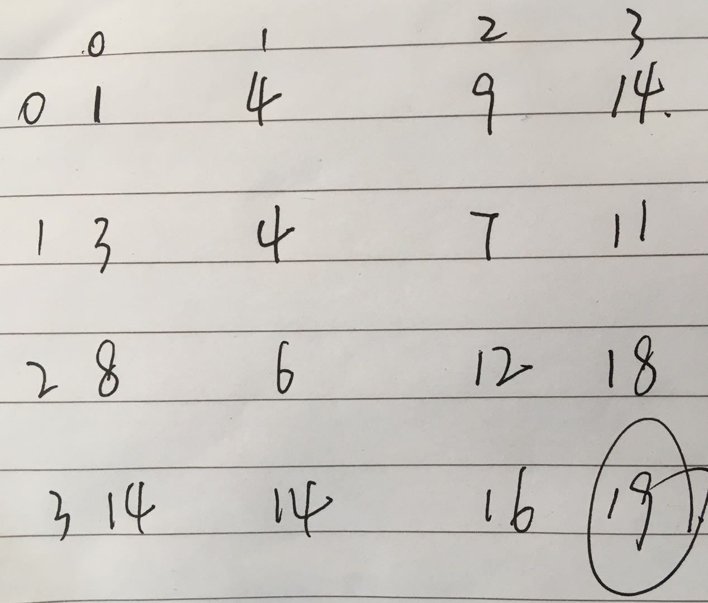

什么样的问题可以使用动态规划?
解决动态规划问题的一般思路?
贪心, 分治, 回溯, 动态规划的联系和区别是什么?

## 一个模型三个特征

**一个模型:** 多阶段决策最优解模型

动态规划是来求解最优解问题, 需要经历多个决策阶段, 每个阶段对应一组状态, 然后寻找一组决策序列, 经过决策序列产生最终期望求解的最终值.

**三个特征:** 1 最优子结构 2 无后效性 3 重复子问题

1 最优子结构

问题的最优解包含子问题的最优解. 可以通过子问题的最优解推导出整个问题的最优解

2 无后效性

对前: 推导后面阶段状态的时候, 只与这一组状态的值有关, 不关心这个状态是怎么一步一步推导出来的
对后: 某个阶段的状态值一旦确定, 就不受之后阶段的决策影响.

3 重复子问题

必须有不同的决策序列到达相同的决策状态的时候.

例子:

假设有一个n*n的矩阵 w[n][n], 矩阵储存的都是正整数. 每次棋子只能向下和向右移动一位, 把棋子路上经过的所有数字加起来的和看作路径的长度,那从左上角到右下角的最短路径是多少?

首先看看是否满足一个模型:

从(0,0)走到(n-1,n-1), 总共要走2*(n-1)步, 也就对应2*(n-1)个阶段, 每个阶段都有向右走或者向下走的两种决策, 每个阶段都有一个状态集合. 

在看看三个特征:
每个子问题的最短路径一定包含在总的问题的最短路径里.
因为只有向下和向右, 所以下一个阶段的状态只会与当前状态有关.而状态一旦确定, 也与之后是什么决策没有关系.
具有重复子问题, 可以通过先右后下, 也可以先下后右的方式到达.

所以是满足动态规划的要求的, 那么下面就是如何进行求解.

**求解的方式有两种**
1 状态转移表法
2 状态转移方程法

1 动态转移表法
通常只能解决二维及二维以下的问题, 高维的不方便以表的形式展出. 形式通常为: (行, 列, 值).

在此问题中, 状态转移表应该是什么样的呢?

