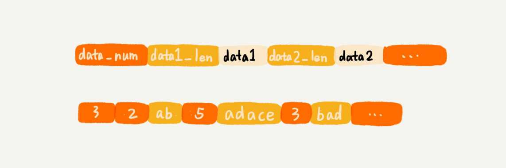
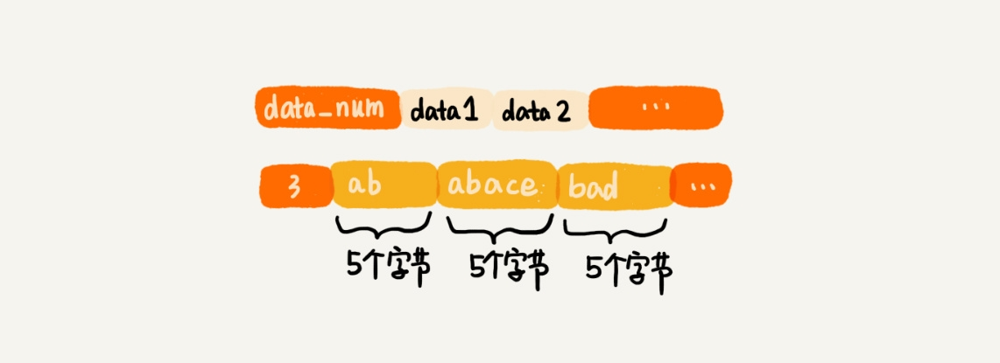

# Redis

## 剖析 Redis 常用数据类型对应的数据结构

### Redis 的数据库是一种 KEY-VALUE 的内存数据库, 主要储存在内存中. 常用的数据类型有:
- 字符串
- 列表
- 字典
- 集合
- 有序集合

### 列表
列表支持储存一组数据, 对应两种实现方法: 
1. 压缩列表
   1. 数据较小
      1. 单个数据小于64个字符
      2. 个数少于512个
   2. 类似数组而不是数组, 相同点是都是连续内存空间, 不同点是允许储存的数据大小不同.
   
   

   3. 压缩意味着节省内存.普通数组的元素的长度都相同, 可以看到下面的占用空间肯定是比上图多的
  
   
   
2. 双向循环链表
   1. 列表中储存的数据量比较大.

```c
typedef struct listnode {
  struct listNode *prev;
  struct listNode *next;
  void *value;
} listNode
typedef struct list {
  listNode *head;
  listNode *tail;
  unsigned long len;
  // ...其他定义
} list
```

### 字典
储存一组数据对. 字典的类型也有两种, 一种是压缩列表, 一种是散列表

同样, 储存的数据比较小时, 使用压缩列表.
否则使用散列表实现, 具体算啊为 MurmurHash2哈希函数. 并用链表法解决 hash 冲突.

当数据动态增大时, 散列表装载因子大于1时触发扩容, 会扩大为原来的两倍左右

数据动态减少时, 为节省内存, 装载因子小于0.1的时候会触发缩容,缩小为原来的1/2左右

扩容缩容都需要做大量的数据搬移和 hash 值的重新计算, redis 采用分批进行的方式降低影响

### 集合(set)

储存一组不重复的数据, 也有两种:
1. 有序数组: 数据较小时
2. 散列表: 数据较大时

### 有序集合(sortedset)
同样两种, 数据量较小时使用压缩列表, 否则使用跳表


## 如何将数据持久化到硬盘, 主要两种解决思路:

1. 清楚原有的储存结构, 只将数据储存到磁盘中, 从磁盘还原的时候, 重新组织成原来的数据结构
   1. 缺点是还原时会耗费较多的时间, 比如 hash 表会需要重新进行哈希函数的计算.如果储存几个 GB 的数据, 还是很耗时的
  
2. 保留和原来相同的储存格式, 储存在磁盘中. 但是就比较消耗磁盘的大小.


## 为什么 Redis 要采用两种数据结构而不直接用一个?

1 连续内存查找更迅速, 但是连续内存对数据大小敏感度很高.
2 大小限制有更好的利用 CPU 的缓存


