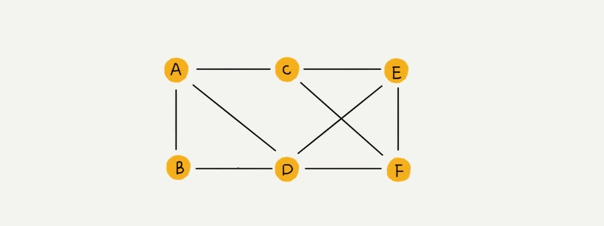

# 图

- 实现有向图, 无向图, 有权图, 无权图的邻接矩阵和邻接表的表示方法

- 无向图和有向图(无权)


```js
function get_matrix(graph) {
    let result = []
    for (let i = 0; i < graph.size; i ++) {
        for (let j = 0; j < graph.size; j ++) {
            if (graph.hasEdge(i,j) || graph.hasPointEdge(i,j)) {
                result[i] ? result[i][j] = 1 : (result[i] = [] && result[i][j] = 1)
            }
        }
    }
    return result
}
function get_adjacency(graph) {
    let result = []
    for (let i = 0; i < graph.size; i++) {
        for (let j = 0; j < graph.size; j ++) {
            if (graph.hasEdge(i,j)) {
                result[i] ? result[i].next = new Node(j) : result[i] = new Node(j)
            }
        }
    }
    return result
}
```
- 有权图

```js
function get_matrix(graph) {
    let result = [];
    for (let i = 0; i < graph.size; i ++) {
        for (let j = 0; j < graph.size; j++) {
            if (graph.hasEdge(i,j) || graph.hasPointEdge(i,j)) {
                result[i] ? result[i][j] = graph.getEdgeValue(i,j) : (result[i] = [] && result[i][j] = graph.getEdgeValue(i,j))
            }
        }
    }
    return result
}

```
- 实现图的深度优先搜索, 广度优先搜索

```js
// 都没有做剪枝. 可以使用一个{}来储存访问过的节点, 减少递归和遍历的次数
function DFS(graph, s, t) {
    function find(vetex) {
        const queue = graph.findNext(vetex);
        for (let i = 0; i < queue.length; i++) {
            if (queue[i] === t) return 'found';
            find(queue[i])
        }
    }
    find(s)
}

function BFS(graph, s, t) {
    let queue = graph.findNext(s)
    while(queue.length) {
        const vertex = queue.pop()
        if (vertex === t) return 'found'
        queue = queue.concat(graph.findNext(vertex)) 
    }
}
```
- 实现Dijkstra算法, A*算法

```js
// PriorityQueue为一个小顶堆优先级队列, s,t为顶点的索引, v为顶点的个数
function Dijkstra(s,t,v) {
    const processed = new Array(v)
    const vertexs = new Array(v)
    const inqueue = new Array(v)
    for (let i = 0; i < v; i ++) {
        vertexs[i] = new Vertex(i, Number.MAX_VALUE)
        inqueue[i] = false
    }
    let queue = new PriorityQueue(v);
    vertexs[s].dist = 0;
    inqueue[s] = true;
    queue.add[vertexs[s]]
    while(!queue.empty) {
        const vertex = queue.pop()
        if (vertex.id === t) break
        for (let i = 0; i < this.adj[vertex].length; i ++) {
            const edge = this.adj[vertex][i]
            const nextVertex = vertexs[e.tid]
            if (e.worth+vertex.dist < nextVertex.dist) {
                nextVertex.dist = e.worth+vertex.dist
                processed[nextVertex.id] = vertex.id
                if (inqueue(nextVertex.id)) {
                    queue.update(nextVertex)
                } else {
                    inqueue(nextVertex.id) = true
                    queue.add(nextVertex)
                }
            } 
        }
    }
    function print(s,t) {
        if (s === t) return
        print(s,processed[t])
        console.log('--->', t)
    }
    print(s,t)
}
// 其实根Dijkstra很类似, 只是A+树引入了一个修正因子, 除了dist之外还有一个顶点到终点的曼哈顿距离(math.sqrt(x**2, y**2)), 然后小顶堆PriorityQueue是以加入了修正因子的距离来堆化的
function Aplus(s,t,v) {
    const processed = new Array(v)
    const vertexs = new Array(v)
    const inqueue = new Array(v)
    for (let i = 0; i < v; i ++) {
        vertexs[i] = new Vertex(i, Number.MAX_VALUE)
        inqueue[i] = false
    }
    let queue = new PriorityQueue(v);
    vertexs[s].dist = 0;
    inqueue[s] = true;
    queue.add[vertexs[s]]
    while(!queue.empty) {
        const vertex = queue.pop()
        for (let i = 0; i < this.adj[vertex].length; i ++) {
            const edge = this.adj[vertex][i]
            const nextVertex = vertexs[e.tid]
            if (e.worth+vertex.dist < nextVertex.dist) {
                nextVertex.dist = e.worth+vertex.dist;
                // 这里引入修正因子
                nextVertex.f = nextVertex.dist + +manhattn(vertex, nextVertex)
                processed[nextVertex.id] = vertex.id
                if (inqueue(nextVertex.id)) {
                    queue.update(nextVertex)
                } else {
                    inqueue(nextVertex.id) = true
                    queue.add(nextVertex)
                }
            } 
            // 一旦有走到终点就终止
            if (nextVertex.id === t) {
                queue.clear()
                break
            }
        }
    }
    function print(s,t) {
        if (s === t) return
        print(s,processed[t])
        console.log('--->', t)
    }
    print(s,t)
}
```
- 实现拓扑排序的Kahn算法, DFS算法

```js
// kahn算法 找到入度为0的顶点, 并将其放入到queue中, 然后将其所有链接的其他顶点入度减1, 假设依赖关系是 A-->B, B的入度为1, A的入度为0, B为A的链接, 传入参数为一个邻接表

function Kahn(adj) {
    const n = adj.size()
    let queue = Array(n);
    let inDegree = [];
    for (let i = 0; i < n; i ++) {
        // 初始化所有入度为0
        inDegree[i] = 0;
    }
    for (let i = 0; i < n;i ++) {
        for (let j = 0; j < adj[i].size(); j++) {
            const w = adj[i].get(j);
            // 找到邻接表链接顶点
            inDegree[w]++
        }
    }
    for (let i = 0; i < n; i ++) {
        if (inDegree[i] === 0) {
            queue.push(i)
        }
    }
    while(queue.length) {
        let i = queue.pop()
        console.log('--->', i)
        for (let j = 0; j < adj[i].size(); j++) {
            const w = adj[i].get(j)
            inDegree[w]--
            if (inDegree[w] === 0) queue.push(w)
        }
    }
}

// DFS算法 与DFS查找有起终点一条路径不同, 此处用的DFS为深度遍历所有的路径

function DFS(adj) {
    // 构建逆邻接表
    const n = adj.length
    const revAdj = Array(n)
    const visited = Array(n)
    for (let i = 0; i < n; i ++) {
        revAdj[i] = new LinkedList()
    }
    for (let i = 0; i < n; i ++) {
        for(let j = 0; j < adj[i].size(); j ++) {
            const w = adj[i].get(j) // i-->w
            revAdj[w].add= i // w --> i
        }
    }
    for (let i = 0; i < n; i ++) {
        if (!visited[i]) {
            visited[i] = true
            dfs(i, revAdj, visited)
        }
    }
    function dfs(vertex, adj, visited) {
        for (let i = 0; i < adj[vertex].size(); i ++) {
            const w = adj[vertex].get(i)
            if (visited[w]) continue
            visited[w] = true
            def(w, adj, visited)
        }
        console.log('-->', vertex)
    }
}
```