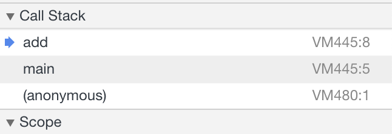

# 第七讲 栈 如何实现浏览器的前进和后退功能

## 栈是一个先进后出的数据结构, 跟浏览器的历史记录很相似, 回退的时候是退到最新入栈的记录.下面用 js 来实现一个栈的功能

```js
// 基于数组实现的顺序栈
class ArrayStack {
  constructor(n) {
    this.items = new Array(n)
    this.length = n 
    this.count = 0
  }
  push(item) {
    if (this.count < this.length) {
      this.items[this.count] = item
      this.count += 1
    } else {
      // 数组已满
      throw Error('stack full')
    }
  }
  pop() {
    // 数组为空
    if (this.count === 0) return null;
    this.count -= 1
    var item = this.items[this.count]
    this.items[this.count] = null
    return item;
  }
  get value() {
    if (this.count === 0) {
      throw Error('stack empty , use push to add item')
    }
    return this.items[this.count - 1]
  }
}
```
### 储存数据需要一个大小为 n 的数组, 但是空间复杂度并不是O(n), 因为这个 n 是必须的, 无法省掉. 一般来说空间复杂度是指除了原本的储存空间外, 算法运行还需要的额外空间, 所以在出栈和入栈中都只是用了几个变量, 空间复杂度为1, 时间复杂度也只是站定数据的操作, 也是 O(1)

### 上述的栈是无法扩容的, 初始为 n 大小就只能为 n, 如果想实现动态扩容可以怎么做呢? 还记得之前说过的均摊复杂度算法吗?虽然每次栈满之后都会有一个 复杂度为 n 的遍历, 但是均摊复杂度为 O(1)

只需要修改 push 中的方法

```js
push(item) {
  // 当栈已满
  if (this.count === this.length) {
    // 进行扩容 
    this.length *= 2
    this.items = this.items.concat(new Array(this.length)) 
  }
}
```

## 栈在函数调用的应用

### 操作系统为每个线程分配了一块独立的内存空间, 这块内存被组织成"栈"这种结构, 用来储存函数调用时的临时变量, 每进入一个函数, 就会将临时变量座位栈帧入栈, 当函数调用执行完毕, 则会将这个函数对应的栈帧出栈.

```js
function main() {
  debugger
  var a = 1
  var b = 2
  return add(a,b)
}
function add(num1, num2) {
  var sum = 0
  sum = num1 + num2
  return sum
}
main()
```

可以在 scope 中看到 add 中包含了变量 num1, num2, sum, main 包含了变量 a, b, 函数调用均按照入栈出栈的规律

那我们来计算 3+5*8-6, 需要两个栈, 一个栈用来储存数值, 一个栈用来储存运算符, 规律是, 当遇到优先级比栈顶高的则进行运算, 为方便比较,运算符可以用一个带有优先级的对象表示

```js
class ArrayStack {
  constructor(n) {
    this.items = new Array(n)
    this.length = n 
    this.count = 0
  }
  push(item) {
    if (this.count < this.length) {
      this.items[this.count] = item
      this.count += 1
    } else {
      // 数组已满
      throw Error('stack full')
    }
  }
  pop() {
    // 数组为空
    if (this.count === 0) return null;
    this.count -= 1
    var item = this.items[this.count]
    this.items[this.count] = null
    return item;
  }
  get value() {
    if (this.count === 0) {
      return null
    }
    return this.items[this.count - 1]
  }
}
// 低级运算
function calc_low_level(op_stack, num_stack, current_op) {
  while (op_stack.value && current_op.level <= op_stack.value.level) {
    var first  = num_stack.pop()
    var second = num_stack.pop()
    num_stack.push(op(op_stack.pop(), second, first))
  }
  op_stack.push(current_op)
}
// 运算
function op(op_obj,a,b) {
  switch (op_obj.op) {
    case '+':
      return (Number(a) + Number(b))
    case '-':
      return (a - b)
    case '/':
      return (a / b)
    case '*':
      return (Number(a) * Number(b))
    case '^':
      return (a ** b)
  }
}
function calc(calc_str) {
  // 先初始化大小为5的栈
  var num_stack = new ArrayStack(5)
  var operator_stack = new ArrayStack(5)
  // 得到数字
  var num_arr = calc_str.split( /[\+\*\-\/\^]/)
  var operator_arr = calc_str.split(/\d+/)
  operator_arr = operator_arr.filter(item => item !== '')
  var level1 = ['+','-']
  var level2 = ['*', '/']
  var level3 = ['^']
  operator_arr = operator_arr.map(item => {
    if (level1.includes(item)) {
      item = {op: item, level:1}
    } else if (level2.includes(item)) {
      item = {op: item, level:2}
    } else {
      item = {op: item, level:3}
    }
    return item
  })
  for (let i = 0; i < num_arr.length; i++) {
    if (i > 0 && i < (num_arr.length - 1)) {
      if(operator_arr[i].level <= operator_stack.value.level) {
        num_stack.push(num_arr[i])
        calc_low_level(operator_stack, num_stack, operator_arr[i])
        continue
      }
    } else if (i === (num_arr.length - 1)) {
      num_stack.push(num_arr[i])
      calc_low_level(operator_stack, num_stack, operator_stack.value)
      return num_stack.items
    }
    num_stack.push(num_arr[i])
    operator_stack.push(operator_arr[i])
  }
}
```
