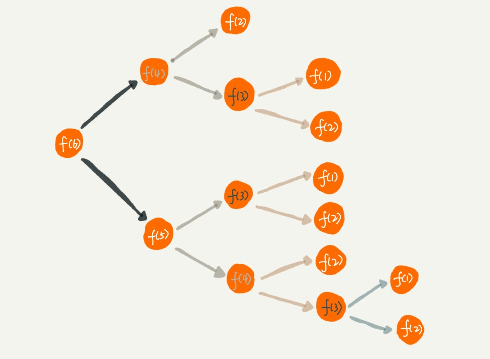

# 第九讲-- 递归 如何用三行代码找到"最终推荐人"

## 推荐注册用户返佣金的这套互联网玩法层出不穷, 也是拉新促活的一个重要手段. 比如 A 用户推荐了 B, B 推荐给了 C, C 进行了注册, 这个推荐人是算成谁呢? 一般来说是第一个推荐的人, 也就是 A

## 我们可以设计一个对象, 包含了 user_id 和 referer_id.那么现在的问题是如果有一个用户的 ID, 如何查找这个用户的最终推荐人? --> 使用递归

## 递归的本质是将一个大问题分解成各个小问题的连接体,用公式表达就是 f(n) = f(n-1) + 1, 这个公式就f(n)这个大问题变成了f(n-1)的小问题, 一直循环下去, 那么 f(n)终将会变成 f(0), f(1), 这就是递归

## 递归需要满足的三个条件:

- 有终止态, 比如f(0), f(1)
- 可分解, f(n)是有规律的, 可以有其他小的问题组合, 比如 f(n-1)+f(n-2)+1等
- 有递推公式, 分解的子问题求解的思路与 大问题完全一样, 比如 f(n) 和 f(n-1)的组合规律应该是完全一样

## 一个题看递归

### 假设有 n 个台阶, 每次你可以选择跨一个或者两个台阶, 请问走这 n 个台阶有多少种走法?比如 如果有 7 个台阶, 可以选择 1 2 2 2组合, 也可以选择1 2 1 1 2 这样的组合.

#### 考虑最开始的情况, 最开始只能是1 走一个台阶, 然后加上 n-1 个台阶的走法, 或者 2 走两个台阶, 然后加上 n-2 个台阶的走法,用公式表达就是 f(n) = f(n-1) + f(n-2).来看一下终止态当 n = 1 的时候有一种走法, 当 n= 2的时候有两种走法(1,1或者2), 所以f(1) = 1, f(2) = 2,转化成递归的代码则是:
```js
function up(n) {
  if (n === 1) {
    return 1
  }
  if (n === 2) {
    return 2
  }
  return up(n - 1) + up(n - 2)
}
```
### 解决递归的关键跟递归的三个条件一样, 找到递归公式就成功了一般, 然后是找终止态, 再将其组合为代码即可.

## 警惕栈溢出

### 第七讲--栈结构--的时候有讲过调用栈.每调用一个函数,则需要把这个函数入栈, 然后执行, 当执行完毕的时候才能出栈, 当入栈的函数过多的时候就会造成栈溢出, 而在递归时, 往往每一次的递归都会入栈, 随着递归深度的不断加深, 入栈的函数会越来越多, 而之前的函数因为没有得到返回值, 还未执行完毕, 所以也不能出栈, 最终导致了栈数量的线性增长. 很容易导致栈溢出

### 如何防止?

- 在代码中限制深度,拿个全局变量, 每次递归加1, 但是这个方法不能完全解决问题, 最大递归深度应该是跟当前线程剩余栈空间大小有关,事先无法计算, 在深度较小时可以用, 否则不是很实用
- 使用尾调用
- 改成循环 **一切用递归写的都能用循环来写----尼克拉斯·夏**


#### 重点讲尾调用, 将上述 up 代码变形为尾递归
```js
// a为每一次的次数累加
function up(n, a = 1, b =2) {
  if (n === 1) return a
  return  up(n - 1, b, a + b)
}
```
#### 但是现在尾调用的使用还不是很广泛, 支持度不是很高, 下面是 V8 的官方解释
> Proper tail calls have been implemented but not yet shipped given that a change to the feature is currently under discussion at TC39.
#### 理由是:
- 引擎层面消除尾递归是隐式行为, 程序员写代码的时候可能意识不到写了死循环的代码, 死循环之后不会出现`stack overflow`的错误, 难以识别
- 堆栈信息的丢失, 增大调试难度

在 chrome 中试了一下, 没有对尾调用进行优化
```js
function up(n, a = 1, b =2) {
console.trace()
  if (n === 1) return a
  return  up(n - 1, b, a + b)
}
undefined
up(3)
VM212:2 console.trace
up @ VM212:2
(anonymous) @ VM223:1
VM212:2 console.trace
up @ VM212:2
up @ VM212:4
(anonymous) @ VM223:1
VM212:2 console.trace
up @ VM212:2
up @ VM212:4
up @ VM212:4
(anonymous) @ VM223:1
```

### 那么看看改成循环, 是可以消除栈溢出的问题, 但是理解起来不如递归那么简单
```js
function up(n, a = 1, b = 2) {
  while(n > 1) {
    [a, b] = [b, a+b]
	  n --
  }
  return a
}
```
## 除了上述的栈溢出的问题之外, 还需要注意递归调用的重复计算优化


### 可以看到重复计算了 f(4), f(3), f(2),f(1), 为了避免重复计算此问题, 可以通过一个数据结构, 比如散列表,保存已经求解过的 f(k), 比如 js 中的 map, 上述代码可更改为:
```js
var fun_res = {}
function up(n) {
  if (n === 1) {
    return 1
  }
  if (n === 2) {
    return 2
  }
  !fun_res[n-1] && fun_res[n-1] = up(n-1)
  !fun_res[n] && fun_res[n] = up(n)
  var res_n_1 = fun_res[n-1]
  var res_n = fun_res[n]
  return res_n_1 + res_n
}
```
## 解答开篇"最终推荐人"的问题
```js
function findRootReferencerId(useId) {
  var refererId = select referer_id from [table] where user_id = userId
  if (!refererId) return userId
  return findRootReferencerId(refererId)
}
```
### 但是有可能有存在一些脏数据, 比如测试工程师测试的时候使用了 A-->B-->C-->A, 会导致无限循环, 如何检测环的存在, 可参考之前的第六讲

### 递归的断点调试不易, 特别是规模较大, 层次较深的递归, 那么应该更好的调试递归呢?

- 打印递归值
- 在某个条件打断点
