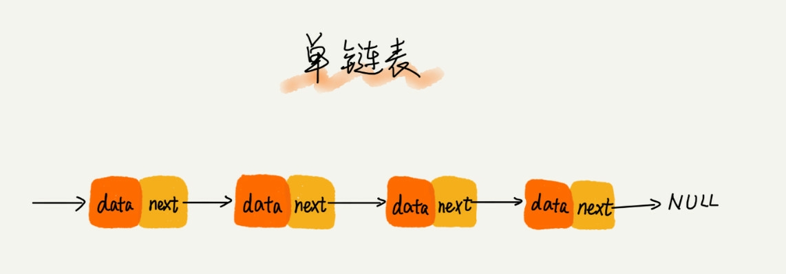

# 第五讲 链表(上) 如何实现 LRU 缓存淘汰算法

## 链表这个数据结构在 js 里边不存在的, 但是在其他语言(比如 Java)中却有很重要的用处.

### 看一个应用场景:

#### 缓存的实现方式, 当缓存被占用满之后, 哪些数据应该被清理出去,哪些又应该保留呢?应该有如下的三种方案:

- FIFO, 最先进的最先出
- LFU, Least Frequency Use, 最少使用策略
- LRU, Least Recently Use, 最近使用策略

## 链表结构方式

### 链表与数组的不同之处

如果需要一个100Mb的数组, 如果储存空间里没有连续的且大于100Mb 的空间会申请失败, 但是链表因为存的都是指针地址, 所以没有这样连续空间的限制.只要存储空间大于100Mb, 就可以申请成功

### 链表结构分类

- 单链表
- 双向链表
- 循环链表

### 单链表

链表是通过指针将不同的内存块串起来, 每一个内存块就可以成为"结点", 所以每个链表的节点除了需要储存数据之外, 还需要记录链上的下一个结点的地址. 把这样向后的指针成为"next"



如果用 js 代码来实现即为:
```js
// 单个 node 的定义
class Node {
  constructor(element) {
    this.element = element
    this.next = null
  }
}
// 创建 LinkList
class LinkList {
  constructor() {
    // 头结点
    this.head = new Node('head')
  }
  // 定义链表方法
  // 搜索
  find() {
    console.log('find')
  }
  // 插入
  insert() {

  }
  // 删除
  delete() {

  }
  // 修改
  modify() {

  }
  // 展示链表
  display() {

  }
}
```
以上定义了每一个节点和链表的结构, 下面来具体分析链表应该具有的方法
## find 寻找
```js
function find(item) {
  // 从链表头开始遍历
  var curNode = this.head
  // 如果当前节点不是最后一个节点, 且不等于需要的 item 则进行遍历
  while(curNode && curNode.element !== item) {
    curNode = curNode.next  
  }
  return curNode
}
```
## insert 插入

```js
function insert(item, target) {
  // 新建节点
  var n = new Node(item)
  // 目标节点
  var targetNode = this.find(target)
  // 新增节点的下一节点为原节点的下一节点
  n.next = targetNode.next
  //原节点的下一节点转移到这个新节点上
  targetNode.next = n
}
```

## 删除节点, 首先要找到该节点之前的节点

```js
// 找到之前的节点
function findPrev(item) {
  var curNode = this.head
  // 如果有当前节点且下一节点不为 item
  while(curNode && curNode.next.element !== item){
    curNode = curNode.next
  }
  return curNode
}
function remove(item) {
  var prevNode = findPrev(item)
  // 如果找不到前节点
  if (!prevNode) {
    throw Error('no item prev found')
  } else if(prevNode.next) {
    // 如果有下一个节点, 即待删除项不是最后一项
    if (prevNode.next.next) {
      prevNode.next = prevNode.next.next
    } else {
      prevNode.next = null
    }
  }
}
```

## 修改节点
```js
function modify(item, new_element) {
  // 找到原节点
  var originNode = this.find(item)
  if (originNode) {
    originNode.element = new_element
  } else {
    // 如果没有则报错
    throw Error('modify failed: no this item')
  }
}
```

## 查看整个链表
```js
function display() {
  // 新建一个空列表
  var all_list = []
  // 获取头节点
  var curNode = this.head
  // 如果有下一节点
  while(curNode.next) {
    all_list.push(curNode)
  }
  // 返回列表
  return all_list
}
```

## 最后来看一下这个 LRU, 如果用户使用过则将其插入到链表头,
```js
function LRU(ele) {
  this.insert(ele, this.head.element)
  this.remove(ele)
}
```

所以整个 LinkList 的代码为:
```js
class Node {
  constructor(element) {
    this.element = element
    this.next = null
  }
}
class LinkList {
  constructor(head) {
    this.head = new Node(head)
  }
  find(item) {
    var curNode = this.head
    while(curNode && curNode.element !== item) {
      curNode = curNode.next  
    }
    return curNode
  }
  insert(item, target) {
    var n = new Node(item)
    var targetNode = this.find(target)
    n.next = targetNode.next
    targetNode.next = n
  }
  findPrev(item) {
    var curNode = this.head
    if (curNode.element === item) {
      return null
    }
    while(curNode.next){
      if (curNode.next.element === item) {
        break
      } else {
        curNode = curNode.next
      }
    }
    debugger
    return curNode
  }
  remove(item) {
    var prevNode = this.findPrev(item)
    if (!prevNode) {
      throw Error('no item prev found')
    } else if(prevNode.next) {
      if (prevNode.next.next) {
        prevNode.next = prevNode.next.next
      } else {
        prevNode.next = null
      }
    }
  }
  modify(item, new_element) {
    var originNode = this.find(item)
    if (originNode) {
      originNode.element = new_element
    } else {
      throw Error('modify failed: no this item')
    }
  }
  display() {
    var all_list = []
    var curNode = this.head
    while(curNode) {
      all_list.push(curNode.element)
      curNode = curNode.next
    }
    return all_list
  }
  LRU(ele) {
    this.remove(ele)
    this.insert(ele, this.head.element)
  }
}
var llist = new LinkList(1)
llist.insert(2,1)
llist.insert(3,1)
llist.insert(4,1)
llist.insert(5,1)
llist.LRU(3)
```
## 由此, 则可模拟出 LRU 模式了, 如果缓存不够那么久删除链表末尾即可.