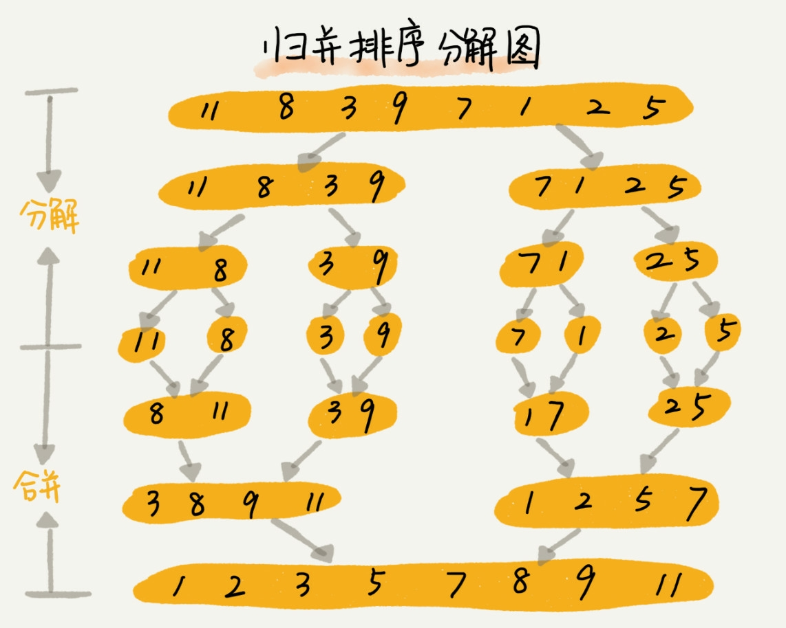

# 第十一讲 - 快排和归并排序

## 先抛出问题: 如何利用快排在复杂度为 O(n)内查找第 K 大元素? 排序(上)中的复杂度都是 O(n<sup>2</sup>), 在小规模数据的时候还好, 大规模数据就比较费时, 有没有更高效的排序方式呢?

## 先来看归并(Merge Sort), 跟之前描述的递归有一些类似, 同样也是大问题化小的分治思想. 重点是 merge 函数



### 归并的递推公式: `merge_sort(p...r) = merge(merge_sort(p...q), merge_sort(q+1...r))`, 终止条件为: p >= r

### 这样就把一个大问题(p-->r) 分解为了 p-->(p+r)/2=q, q+1-->r 的两个小问题, 然后将两个合并起来. 局部有序到全部有序

### 直接上代码
```js
function merge_sort(arr) {
  var len = arr.length
  merge_sort_partial(arr, 0, len - 1)
}
// 部分排序
function merge_sort_partial(arr, p, r) {
  if (p >= r) return
  // 注意这里开始了分治
  var q = (r+p)>>1
  merge_sort_partial(arr, p, q)
  merge_sort_partial(arr, q+1, r)
  merge(arr, p, q, r)
}
// 如何合并
function merge(arr, p, q, r){
  var i = p, j = q+1, k = 0;
  var newArr = new Array(r-p+1)
  debugger
  while (i <= q && j <= r) {
    if (arr[i] <= arr[j]) {
      newArr[k++] = arr[i++]
    }else {
      newArr[k++] = arr[j++]
    }
  }
  // 如果 arr[p,q]元素已经遍历
  if (i === q+1) {
    for (var v = j;v <= r; v++) {
      newArr[k++] = arr[v]
    }
  } 
  // 否则如果 arr[q+1, r]已经遍历完毕
  else if (j === r+1) {
    for (var v = i;v <= q; v++) {
      newArr[k++] = arr[v]
    }
  }
  for (var v = 0; v <= r-p; v++) {
    arr[p+v] = newArr[v]
  }
}
var a = [5,4,6,7,3,2,1]
merge_sort(a)
```
### 归并的性能分析

- 是否是稳定排序?
  - 是的, 因为在比较的时候如果等于是不会交换位置的, `arr[i] <= arr[j]`
- 时间复杂度?
  - 假设 分析大问题 a 的时间复杂度为 T(a), b,c分别为 T(b),T(c), `T(a) = T(b)+T(c)+K`, K等于将 T(a)和 T(b)合并的时间, 复杂度为 O(n)
  - T(1) = C(n = 1时, 为常数时间), `T(n) = 2*T(n/2) + n = 2*(2*T(n/4) + n/2) + n = 4*T(n/4)+2*n = 4*(2*T(n/8)+n/4) + 2*n = 8T(n/8)+3*n = 2*k*T(n/2^k) + k*n`
  - 当T(n/2^k) = T(1), 即 k = log<sub>2</sub>n时, T(n) = 2*C*log<sub>2</sub>n+ n * log<sub>2</sub>n,底数可以忽略, 所以复杂度为 O(nlgn)
- 空间复杂度?
  - 如果按照之前的分析方法, 会分析出 O(nlgn)的空间复杂度, 但是因为每次申请完临时的数组之后会被肇事方调, 临时内存的最大空间也不会超过 n 个数据, 所以空间复杂度为 O(n), 所以归并排序不是原地排序算法

## 快排(QuickSort)

### 思想: 如果要排序数组中小标从 p 到 r 之间的一组数据, 我们选择 p 到 r 之间任意一个数据作为 pivot(区分点),然后遍历 p 到 r 的数据. 将小于 pivot 的放左边, 大于的放右边, 将 pivot 放中间, 这样数组就被分成了三部分, 前面的p 到q-1都是小于 pivot 的, 后面的 q+1到 r 都是大于 pivot 的,直到最后区间缩为1, 就说明所有的数据有序

### 递推公式`quick_sort(p...r) = quick_sort(p...q-1)+quick_sort(q+1,r)`终止条件 `p >= r`

### 直接上代码
```js
function quick_sort(arr) {
  var len = arr.length - 1
  quick_sort_partial(arr, 0, len)
}
function quick_sort_partial(arr, p, r) {
  if (p >= r) return
  // 获取分区点, 跟归并的 q = (r+p) >> 1一样, 是转化为小问题的关键
  var q = partition(arr, p, r)
  quick_sort_partial(arr,p, q-1)
  quick_sort_partial(arr, q+1, r)
}
function partition(arr, p, r) {
  var pivot = arr[r]
  // 都是比 pivot 小的数
  var i = p
  for (var j = p; j < r; j++) {
    if (arr[j] < pivot) {
      [arr[i], arr[j]] = [arr[j], arr[i]]
      i++
    }
  }
  [arr[i], arr[r]] = [arr[r], arr[i]]
  return i
}
var a = [5,4,6,7,3,2,1]
quick_sort(a)
```
### 快排的特性
- 不稳定
  - 因为涉及了交换, 如果有一个值跟pivot 相同, 那么在最后一步交换的时候**可能**会导致顺序颠倒问题

## 快排和归并的区别

### 都是采用了分治, 但是归并是从下到上, 先处理子问题, 再合并, 而快排正好相反, 是从上到下的, 先分区, 再处理子问题. 归并虽然稳定, 时间复杂度为 O(n*logn)但是却不是原地排序, 快排虽然不稳定, 但是是原地排序, 解决了归并内存占用大的问题

### 性能分析
- 归并的复杂度稳定为O(n*logn), 快排的复杂度根据分区是否均衡, 如果均衡的话为O(n*logn), 否则为O(n^2), 但是退化到 O(n^2)的情况并不多, 而且也有办法去把这个概率进一步降低.

## 解答开篇的问题: 如何寻找第 k 大的数, 比如4,2,5,12,3第3大的元素就是4
### 可以用刚刚的 partition 方法, 把 n-1设为 pivot, 将数组分为 arr[0...p-1] arr[p] arr[p+1,n-1], 如果 p+1=k, 那么就是第 arr[p]就是第 k 大的元素了.所以
```js
function find_numth_big(arr, k, m=0, n=arr.length) {
  var i = 0;
  var pivot = arr[n - 1]
  for (let j = 0;j < n - 1; j++) {
    if (pivot>arr[j+m]) {
      [arr[j+m],arr[i+m]] = [arr[i+m], arr[j+m]]
      i++
    }
  }
  debugger
  if(i + 1 + m === k) {
    console.log(arr[i+m])
    return arr[i+m];
  }
  // 起始位
  var new_m = (i + 1 > k) ? 0 : i;
  // 终止位
  var new_n = (i + 1 > k) ? i : n;
  // 交换
  [arr[i], arr[n-1]] = [arr[n-1], arr[i]]
  return find_numth_big(arr, k, new_m, new_n)
}
```
### 看看上面算法的复杂度是多少呢?
#### 第一次遍历 n 个元素, 第二次遍历n/2, 第三次遍历n/4直到1, 所以累加起来为`(1-(1/2)^n) * n / (1/2)`, 即`2*n-2*(1/2)^n*n`, 所以复杂度为 O(n)


