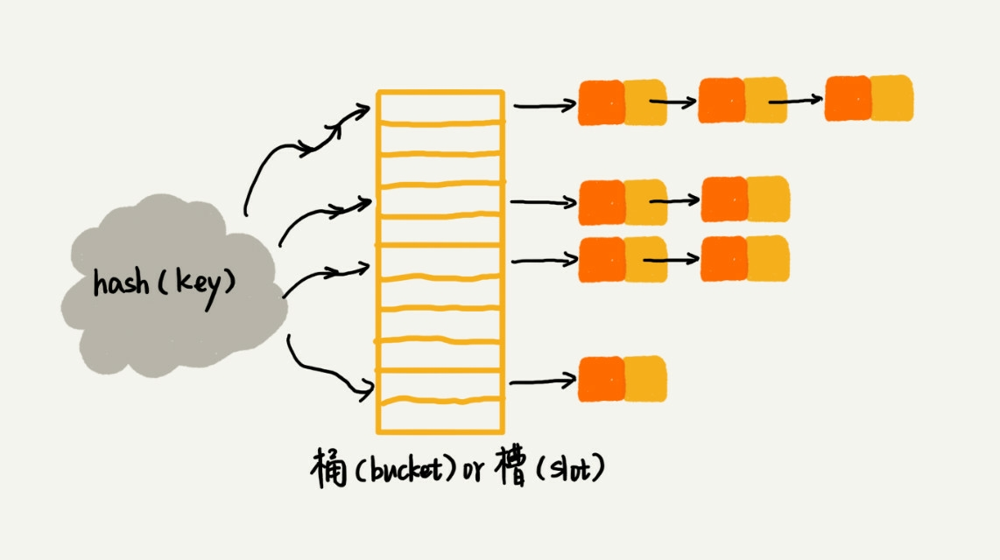

# 散列表(上) word 文档中的单词拼写检查功能是如何实现的?

## 在 word 中有一项功能叫瓶邪检查, 一旦输入错误的英文单词就会以标红的方式提示: '拼写错误', 利用 '散列表'(Hash Table)便可实现这个功能

## 散列思想

### 散列表的英文叫"Hash Table", 平时也叫"哈希表", 它用的是数组, 支持按照下标进行随机访问数据

### 例子: 如果有89名选手胸前都会贴上自己的参赛好嘛, 这89名选手的编号依次是1到89, 现在我们希望编程实现这一的功能, 实现快速找到对应的选手信息. 将89名选手放在数组里, 编号为1的放1, 2的放2, 以此类推, k 的选手放 k, 因为是一一对应, 所以在查询选手的时候直接通过下标访问即可, 复杂度 O(1). 

## 我们把数组的数组下标与数据进行绑定来进行标识或映射的方法叫做散列函数(哈希表), 就可以达到时间复杂度为1的访问查找.那么应该如何构造散列函数?

- 散列函数计算得到的散列值是一个非负整数
- 如果 key1 === key2, 那 hash(key1) === hash(key2)
- 如果 key1 !== key2, 那 hash(key1) !== hash(key2)

### 前两点都很好理解, 但是第三点是需要重点关注的地方, 几遍像最著名的 MD5, SHA, CRC 等哈希算法, 也无法完全避免这种散列冲突, 而且因为数组的储存空间有限, 我们需要把 hash 值转化为数组下标, 因为纯散列值是无法直接拿来当下标的, 会加大散列冲突的概率, 所以我们无法找到一个完美的无冲突的散列函数, 即使能找到, 付出的时间成本和计算成本也是很大的.

## 散列冲突的解决办法
### 开放寻址法: 如果出现散列冲突, 重新探测一个空闲位置, 再插入, 那么如何重新探测新的位置呢? 
#### 线性探测(Linear Probing), 如果某数据经过散列函数之后被占用, 从当前位置开始, 往后查找, 直到有空闲位置为止, 查找的时候, 先比对对应的位置元素是不是待查找的元素, 如果不是, 就向后查找, 如果查找到第一个空闲位置都没有找到, 就说明要查找的元素并没有在散列表中.

#### 散列表跟数组一样, 支持插入, 查找, 删除, 但是对于线性探测法解决冲突的散列表, 删除操作稍微有些特别, 不能单纯的吧要删除的元素设置为空. 因为在查找的时候, 遇到空闲位会停止查找, 那么就有一种情况, 本来我有数据, 但是后来被删除了, 如果为空了, 就找不到这个元素后面的位置了,所以可以设置一个特殊标志: deleted, 如果遇到这个特殊位, 则继续向后查找.
#### 可以看到线性探测法有很多问题, 当散列表中插入的数据越来越多, 散列冲突会越来越大, 空闲位置会越来越少, 极端情况下, 需要探测整个散列表, 所以最坏的时间复杂度为 O(n), 同理, 在删除和查找时, 也有可能退化到O(n), 

#### 二次探测(Quadratic probing): 跟线性探测很像, 线性探测每次探测的步长是1, 探测的下表序列好就是 hash(key) + 1, +2, +3, ... , 而二次探测是探测+0, +1^2, +2^2, ... , 
#### 双重散列(Double hashing); 不仅使用一个散列函数, 而是使用一组散列函数, hash1(key), hash2(key)..., 先用第一个散列函数, 如果计算得到的存储位置已被占用, 则使用第二个散列函数

### 不管使用哪种方法, 在散列表中空闲的位置不多的时候, 散列的冲突概率就会大大的提高, 所以我们需要尽可能的保证散列表中有一定比例的空闲槽位, 用装载银子(load factor)来表示空位的多少.

`装载因子 = 填入表中的元素个数 / 散列表的长度`

### 链表法: 更常用的解决办法. 每个桶(bucket)或者槽(slot)会对应一条链表, 所有散列值相同的元素放到对应的链表中, 当插入时, 只需要通过散列函数计算出对应的散列值槽位, 插入到对应链表中, 顺序不中要, 可以查到头, 也可以插到尾. 删除操作也是同样, 先找到槽位, 然后遍历链表. 这两个操作时间复杂度跟链表的长度 k 成正比, 也就是 o(k), 理论上 k = n / n, n 为槽位数.

## 那么来看开题的问题
### word 中的单词拼写检查.常用的英文单词有20w 个左右, 假设单词的平均长度是10个字母, 平均一个单词占据的内存为10个字节, 20w 个单词占用2MB, 完全是可以放入内存里, 可以用一个散列表储存整个英文的词典.

### 当用户输入某个英文单词时, 拿到用户的单词去散列表中查找, 如果找到则说明拼写正确, 如果没有, 则错误, 并给予提示, 借助散列表这种数据结构, 可以轻松实现快速判断拼写错误

## 课后思考: 
- 如果有10w 条 URL 访问日志, 如何按照访问次数给 URL 进行排序?

1 url 为 key, 访问次数为 value 存在数组里 复杂度为 O(n)
2 如果url 不多可使用桶排序复杂度为 O(n), 如果多使用快排, 复杂度为 O(nlogn)

- 有两个字符串数组, 每个数组大约有10w 条字符串, 如何快速找出两个数组中相同的字符串?

1 将第一个字符串 hash 化, 使用链表储存, 避免冲突, 复杂度为 O(n)
2 将第二个字符串数组遍历查找, 遍历复杂度为 O(n), 查找复杂度 O(1)
