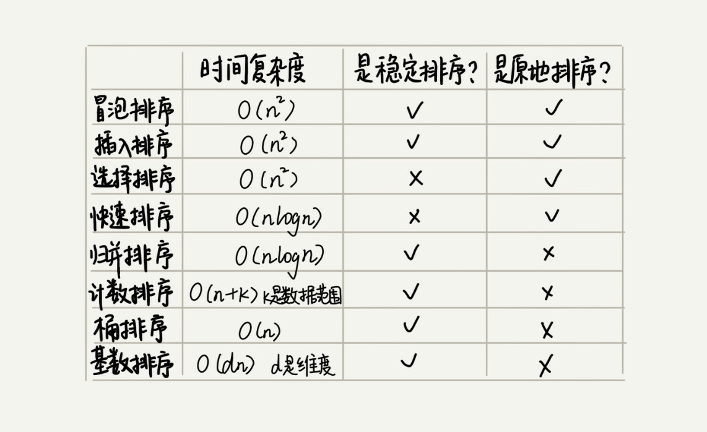

# 排序优化: 如何实现一个通用的, 高性能的排序函数?

## 以下是之前学的排序的总结图, 可以看到彼此的优劣:

### 由图可以看出线性排序的复杂度比较低, 但是适用的场景很有限, 所以要写一个通用的算法, 不能采用线性排序.小规模的排序当然可以采用 O(n^2), 甚至于还优于 O(nlogn),因为在小规模时的常量不可忽略, 但是为了兼顾任意规模, 还是首选 o(nlogn).那么就有两种选择, 归并和快排.

### 归并不是原地排序, 需要额外的储存空间, 所以即使快排的最坏时间复杂度为 O(n^2), 劣于归并的 O(nlogn), 但快排还是成为了更好的选择. 既然有最坏复杂度, 那么就看看有没有办法避免这个最坏时间复杂度, 或者降低最坏时间复杂度发生的概率呢?

## 如何优化快速排序

### 回忆一下如何出现的最坏时间复杂度, 如果本来就是倒序, 从大到小, 那么就会退化到 O(n^2)这是因为我们选择的 pivot为最末尾的元素, 那么只要选择更加合适的分区点, 就会减小比较的次数, 最理想的分区点是被分区点分开的两个分区中, 数据的数量差不多.

### 这里有两种办法:

- 三数取中法: 首尾中间分别取出三个数, 然后对比大小, 取这三个数的中间值作为分区点, 但是如果数组比较大, 三数取中就不够了, 可能要五数取中或者十数取中

- 随机法: 每次从要排序的区间, 随机选择一个元素作为分区点, 不能保证每次分区都选的比较好, 但是从概率上来看至少不会都很差, 所以退化到o(n^2)的可能性不大

### 还有一个问题需要注意, 快排都是使用递归来完成的, 只要是递归就要注意堆栈溢出. 有两种方法:

- 限制递归深度
- 在堆上模拟实现函数调用栈, 手动模拟递归压栈出栈的过程, 这样就没有了系统栈大小的限制

## js 中的排序算法
