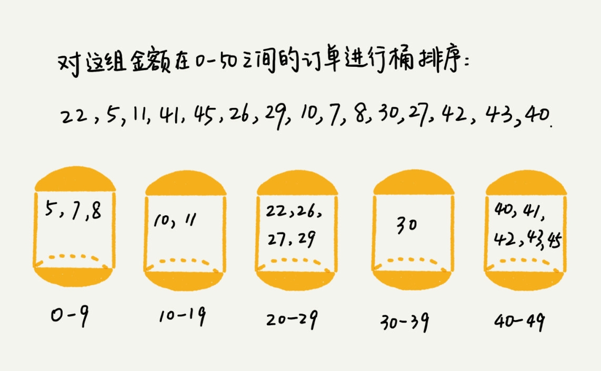

# 之前讲的排序全是非线性的排序, 或者是最好情况为线性的排序, 今天来讲一下线性排序(Linear Sort) -- **桶排序** 和 **基数排序**

## 先引出一个问题吧, 如何给100万用户进行数据排序?

### 如果使用之前讲的归并, 快排也能搞定, 但是时间复杂度最低都是 nlogn, 有没有更快的方式?

### 桶排序(Bucket Sort)

### 顾名思义, 桶排序就是会将要排序的数据分到几个有序的桶中, 每个桶里的数据再单独进行排序, 桶内排序完后, 再依次取出, 组成的序列就是有序的了



### 桶排序为什么时间复杂度是 O(n)呢?

### 如果需要排序的数据为 n 个, 均分到 m 个桶中, 每个桶里就有 n/m 个数据, 对这 n/m 个进行快排或归并, 那么一个桶排序的复杂度为 n/mlog(n/m), n 个桶排序的复杂度为 n*log(n/m), 当 m 十分接近 n 时, log(n/m)是一个非常小的量, 这是候复杂度接近O(n)

### 是否可以替代之前的归并或者快排呢?

### 不能, 因为桶排序的要求十分苛刻
- 数据要十分容易划分, 并且桶与桶之前有天然的大小顺序, 这样将每个桶内的排序完成后不需要再对桶外进行排序

- 桶的分布是比较均匀的, 不然如果有的桶非常多, 非常少, 很不平均, 那么桶内排序就不是常量级了, 在极端情况下, 所有的数据都被划到一个桶内, 那么数据就退化为 O(nlog(n))

### 桶排序比较适合在外部排序中 --- 数据储存在外部磁盘中, 数据量比较大, 内存有限, 无法将数据全部加载到内存中

#### 比如: 有10GB 订单数据, 我们希望按订单金额进行排序, 但是内存有限, 只有几百 MB, 没有办法一次性把10GB 的数据都加载到内存, 这时候应该怎么办?

- 先扫描一遍, 找到最小值和最大值, 假设为0元和10万元, 将所有的数据分到100个桶中, 那么每个桶装的数据范围就确定了, 即类似于: 0--999, 1000--1999 ... 99000--99999
- 理想情况下如果数据为均分, 那么每个桶的数据大概为100MB, 分别将这100个桶放到内存中进行快排
- 桶内排序完成后, 根据文件编号, 从小到大读取小文件中的订单数据, 再写入到一个文件中, 即可完成

#### 你应该也看到了在第二条中, **理想情况**的定义是比较严格的, 通常情况我们的数据都是属于正态分布的, 中间多,两边低, 那么就有可能在某个桶的数据超过了100MB, 这种情况下可以再进行下一级的分桶, 比如10000-10999的数据为150MB, 那么再行细分为10000-10499, 10500-10999两个桶去装.如果还不够就继续分, 直到装下为止

## 计数排序

### 技术排序其实是一种特殊的桶排序, 即每个桶都装一个数据, 粒度很小. 比如: 要排序数据为 n 个, 所处范围也不大,最大值为 K, 我们可以把数据分为 K 个桶, 这样就省掉了桶内排序的时间, 高考分数排名就是这么来的. 比如省内有50w 名考生, 如何通过成绩快速排序得出名次呢?其实就可以用技术排序.

- 最低分0分, 最高分750分, 分为751个桶
- 将分数分到这些桶中
- 扫描每个桶, 将桶内考生依次输出到一个数组中
- 只涉及了遍历, 所以时间复杂度是 O(n)

### 写一个具体的例子吧: 如果有8位考生, 成绩分别是 2,5,3,0,3,0,3,2
- 第一次遍历就得到了一个桶数组: arr = [2,0,2,3,0,1] 数组的下表为分数, 数组元素为人数
- 所以在排好序的数组中, 分数为3的考生所处的位置应该是 arr_sorted 的4,5,6的下标位置

### 如何得到这个排好序的数组呢?有一个很巧妙的方法, 即将 arr 的元素变形为之前所有元素的和, 即
```js
function base_sort(origin_arr) {
  var range = Math.max.apply(null, origin_arr)
  // 桶(基数)数组
  var arr_reduce = new Array(range)
  for (i in origin_arr){
    if (!arr_reduce[origin_arr[i]]) {
      arr_reduce[origin_arr[i]] = 1
    } else {
      arr_reduce[origin_arr[i]] += 1
    }
  }
  // 获取前元素个数和数组, 用此数组作为最终的坐标
  var sum = 0
  var arr_index = arr_reduce.map(ele => {
    var res = sum+ele;
    sum+=ele;
    return sum
  })
  var arr_sorted = []

  origin.map(ele => {
    arr_sorted[arr_index[ele] - 1] = ele
    arr_index[ele] -= 1
  })
  console.log(arr_sorted) // [0, 0, 2, 2, 3, 3, 3, 5]
}
// 初始数组
var origin = [2,5,3,0,3,0,3,2]
base_sort(origin)
```
### 不过需要注意的是只能在数据范围不是很大的场景中来使用, 如果数据范围 k 比排序的 n 大很多, 就不适合用计数排序了, 而且计数排序只能给非负整数排序, 如果要排序的数据是其他类型, 要在不改变相对大小的情况下, 转化为非负整数, 方法有:

- 乘以10^n, 比如分数为精确到两位的, 可以都*100, 最后 ele/100即可
- +max(负数绝对值), 可以将所有数字转化为非负整数, 最后 ele - max(负数绝对值)即可

## 基数排序(Radix Sort)
### 假设有10w 个手机号, 希望将这10w 个手机号码从小到大排序.现在桶排序和计数排序就指望不上了, 因为11位数字太大了, 会需要很多很多的桶, 当然依然可以用快排和归并, 但那样有两个缺点:

- 复杂度为 O(nlog(n))
- 如果有内存限制是无法一下读取到10w 个数据的

### 基数排序就派上了用场, 基数就是指位数, 比如1999这个数他的基数为10^0, 10^1, 10^2, 10^3这四个基数, 如果一个数的10^2级别大, 那么可以不比较10^1级别了, 这样可以减少比较的次数, 在每一位都稳定排序的情况下, 可以保证顺序性, 至于每一位的排序, 可以使用计数排序或者桶排序, 使基数内排序负责度为 O(n), 如果有 k 个基数, 那么就是 kO(n), 在本例中就是11O(n), 近似于O(n)
```js
function radix_sort(origin_arr) {
  for (let i = 10; i >= 0; i --) {
    origin_arr = base_sort(origin_arr, i)
  }
  console.log(origin_arr)
}
function base_sort(origin_arr, radix) {
  // 桶(基数)数组
  var arr_reduce = new Array(10)
  for (let i in origin_arr){
    var num = Number(String(origin_arr[i])[radix])
    if (!arr_reduce[num]) {
      arr_reduce[num] = 1
    } else {
      arr_reduce[num] += 1
    }
  }
  // 获取前元素个数和数组, 用此数组作为最终的坐标
  var sum = 0
  var arr_index = []
  for(let i = 0; i < arr_reduce.length; i ++) {
    if(!arr_reduce[i]) arr_reduce[i] = 0;
    sum += arr_reduce[i];
    arr_index.push(sum)
  }
  var arr_sorted = []
  // 保持稳定性, 从后往前遍历
  for(let i = origin_arr.length - 1; i >= 0; i --){
    var ele = origin_arr[i]
    var num = Number(String(ele)[radix])
    arr_sorted[arr_index[num] - 1] = ele
    arr_index[num] -= 1
  }
  return arr_sorted // [0, 0, 2, 2, 3, 3, 3, 5]
}
var test_arr = [11200000000,12200000000, 11200000001, 21200000000, 12200000000]
radix_sort(test_arr)
```

### 有时候遇到数据不等长的情况 , 比如牛津字典最短只有一个字母, 最长有45个字母, 中文翻译为尘肺病, 共20w 个数据, 这种可以在小于45个字母的单词后面补齐0到45个, 因为根据 ASCII 码, 字母大于数字'0', 不会影响原有的顺序, 跟桶排序的非数据类型的处理有异曲同工之处.

### 所以基数排序的场景有两个限制:
- 有基数的特性, 比如10^3 比较大小后就无需比较10^2
- 基数范围较小, 可以实现线性排序

## 解答开篇, 如何实现100w 用户排序, 类似于考生排序, 可以找到年龄最大和最小, 假设分别为1,120, 我们将其分到120个桶中, 遍历这100w 个用户, 这样就得到了按照年龄排序的100w 用户数据, 如果有内存限制可以先读前面100m, 分批放到桶中.


