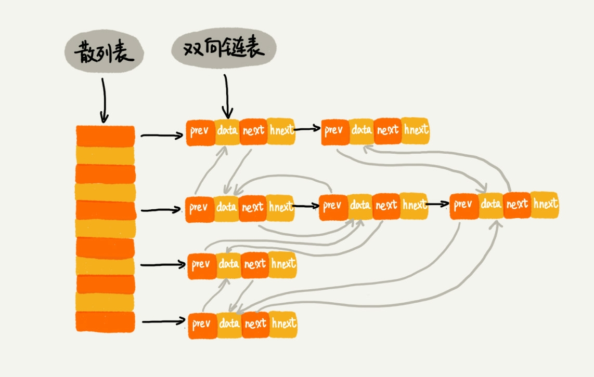

# 为什么散列表要和链表一起使用?

## 在之前讲链表的章节有说过LRU Last Recently Used 缓存淘汰算法.但是实现的时间复杂度时O(n), 提到了可以使用散列表将这个复杂度降为O(1). 在跳表章节, 有Redis有序集合的调表实现, 跳表可以看成时一种改进版的链表, 当时也提到Redis不仅使用了跳表, 也使用了散列表, 除此之外如果熟悉JAVA语法, 其中有一个LinkedHashMap的常用容器, 也使用了散列表和链表

## LRU

### 缓存系统主要包括以下几个操作

- 往缓存中添加一个数据
- 从缓存中删除数据
- 在缓存中查找数据

### 这三个操作都要涉及查找, 但是使用链表的话, 时间复杂度只能时O(n), 如果将散列表和链表结合起来可以将这三者的时间复杂度都降为O(1)

### 我们需要使用双向链表 包括data, prev, next, 来储存数据, 减小删除的时间复杂度, 然后散列表储存每个节点, 当然还需要使用一个特殊的位置用来将链表串连在一起, hnext. 所以实际上有两条链, 一条是实际的链表, 一条是散列表中的拉链



### 由此, 查找的时间复杂度降为O(1), 删除和添加也由此降为O(1), 实现一个高效的LRU算法. 需要注意的是添加一个数据, 有两种情况,
- 1 数据已经在缓存中了, 需要将其移动到双向链表的尾部
- - 2 如果不在缓存中
    - 如果缓存满了: 删除头结点, 尾部添加该数据
    - 没有满, 直接添加到尾部


## Redis有序集合
### 有序集合中每个成员对象有两个重要的属性: key(键值), score(分值), 不仅会通过key查找数据, 也可以通过score来查找.

### 举个例子: 我们可以通过积分区间查找用户ID或姓名信息, 这里包含ID, 姓名, 积分信息, 就是成员对象, 用户ID就是key, 积分就是score

### 有序集合的操作有:
- 添加一个成员对象
- 按照键值删除对象
- 按照键值查找对象
- 按照分值查找数据, 比如查找积分在[100, 356]之间的成员对象
- 按照积分值从小到大排序成员信息

### 之前是使用了跳表. 但是跳表在删除或查询成员对象时会很慢, 解决方法跟LRU类似, 使用键值构建散列表, 按照key进行删除, 查找成员对象的时间复杂度就降到O(1), 同时借助跳表结构, 其他操作也将十分高效

## LinkedHashMap
```java
HashMap<Integer, Integer> m = new LinkedHashMap<>(10, 0.75f, true)
m.put(3,11)
m.put(1,12)
m.put(5,23)
m.put(2,22)

m.put(3,25)
m.get(5)
for(Map.Entry e : m.entrySet()) {
    System.out.println(e.getKey())
}
```
### 打印结果为1,2,3,5, 这个结构就是使用的双向链表加上散列表来构成的数据结构, 可用于LRU缓存淘汰策略中.