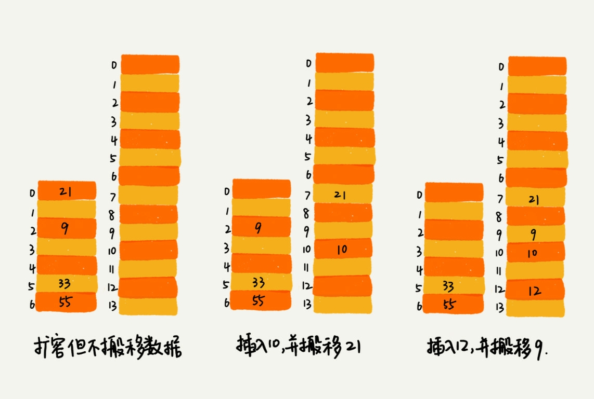

# 散列表中: 如何打造一个工业级水平的散列表

## 通过散列表上已知散列表的查询效率不能笼统的说成是 O(1), 跟散列函数, 装载因子, 散列冲突等都有关系. 

### 在极端情况下, 有恶意的攻击者通过设计的构造数据, 使所有的数据都到一个槽里, 如果我们使用的是基于链表的冲突解决办法, 那么散列表就会退化为链表, 查询的时间复杂度也从 O(1)急剧退化到O(n).如果有10w 个数据, 退化后的查询效率就下降了10w 倍, 从时间上来说, 如果之前查询只需要0.1s, 现在就需要1w 秒 ,这回极大的消耗 CPU 或线程资源, 导致无法响应请求, 达到拒绝服务(DoS)的攻击目的.这也是**散列表冲撞的基本原理**

## 如何设计一个可以应对各种异常的工业级散列表, 避免在散列冲突的情况下, 散列表的性能急剧下降并且能抵抗散列碰撞攻击?

### 如何设计散列函数

#### 散列函数的好坏直接决定了散列表冲突的概率大小, 也直接决定了散列表的性能, 好的散列表需要满足以下几点:

- 设计不能太复杂, 否则会消耗很多的计算时间.
- 生成的值尽可能随机并且均匀分布, 1是最小化散列冲突2是即使冲突, 散列到每个槽里的数据也会比较平均

#### 几个常用的散列函数设计方法

- 数据分析法: 通过分析数据得出散列值,手机尾号后四位是比较不容易冲突的, 反之, 手机号的前三位的冲突概率大很多, 所以选择后四位作为散列值.
- 公式法: 上次说到的 word 拼写检查, 我们可以将单词中每个字母的 ASCII 码值进行相加, 然后再跟散列表的大小求余, 取模, 作为散列值. 比如英文单词 nice 就是下面这样:
```
hash(nice) = (("n" - "a") * 26^3 + ("i" - "a") * 26^2 + ("c" - "a") * 26 + ("e" - "a")) / 78978
```
- 直接寻址法
- 平方取中法
- 折叠法
- 随机数法

### 装载因子过大怎么办

- 导致空闲位置减少, 冲突的概率加大, 插入数据过程需要多次寻址或拉很长的链, 查找过程也会变慢. 
- 对于没有频繁插入和删除的静态数据集合来说, 很容易根据数据特点, 分布等设计出完美的极少冲突的散列函数. 
- 对于动态的来说, 无法预估数据个数, 也无法实现申请一个足够大的散列表, 当装载因子大到不能接受的程度, 可以选择扩容, 重新申请, 但是意味着数据的迁移, 比数组复杂很多
- 数据迁移: 散列表大小变了, 所以数据的存储位置也变了, 需要通过散列函数对已有的每个数据重新求值, 这样就会大大加大计算的时间. 会导致用户感知到在某一次插入数据的时候, 会需要花费很长的时间.
- 分摊迁移: 用户的一次超过原大小的插入, 将其插入到新散列表中, 同时将原有的一个散列值重新经过散列函数之后放到新散列表, 相当于每次插入会迁移一次原数据, 这样将一次性插入均摊到每一次的插入,不会让用户感受到卡顿.那么查找的时候, 就需要现在原散列表和新散列表中查找.
- 如果对空间消耗十分敏感, 可以使用动态缩容.即当装载因子小于某个值的时候, 将原散列表迁移到更小的散列表中.但一般会用空间换时间



## 如何选择冲突解决办法?

- 开发寻址法(Java 的 ThreadLocalMap)
  - 优点
    - 不需要拉很多链表
    - 储存在数组中, 可以有效利用 CPU 缓存加快查询速度
    - 序列化简单, 因为不包含链表包含的指针
  - 缺点
    - 删除数据麻烦, 需要特殊标记
    - 所有的数据存储在一个数组中, 冲突的代价更大, 装载因子上限不能太大, 比链表法更浪费空间
  - 应用
    - 数据量比较小
    - 装载因子小
  
- 链表法
  - 优点
    - 内存利用率, 链表节点在需要时在创建, 不需要像开放寻址那样实现申请
    - 大装载因子的容忍度更高, 即使装载因子到了10, 也只会把每个槽位的链表长度边长, 虽然查找效率有所下降, 但是比起顺序查找还是快很多
  - 缺点
    - 存储指针, 对于比较小的对象来说, 比较消耗内存, 甚至让内存翻倍
    - 零散分布到内存中, 不连续, 无法 CPU 缓存影响执行效率
    - 如果是大对象, 也就是说存储对象的大小远远大于一个指针的大小: 4个字节或8个字节, 那链表的内存消耗就可以忽略了.
  - 场景
    - 储存大对象, 大数据量的散列表
    - 可用红黑树代替链表, 即使出现冲突, 也不过是 O(logn)
## 工业级散列表, 拿 Java HashMap 举例
- 1 初始大小 16, 这个默认值可配置, 如果事先知道数据量多大, 可以修改默认初始大小, 减少动态扩容次数
- 2 动态装载因子: 默认0.75, 超过0.75 * capacity 之后会扩容为2 * capacity
- 3 散列冲突解决方法: 链表法 但是也可能出现链条过长, 所以在 JDK1.8版本中, 引入红黑树, 链表长度过长(超过8), 链表转换为红黑树, 少于8时, 转换回链表, 因为红黑树要维护平衡, 数据量小的情况下并不比链表有优势.
- 4 散列函数
```
int hash(Object key) {
  int h = key.hashCode();
  return (h ^ (h >>> 16)) & (capacity - 1)
}
public int hashCode() {
  int var1 = this.hash;
  if (var1 == 0 && this.value.length > 0) {
    char[] var2 = this.value;
    for (int var3 = 0; var3 < this.value.length; ++var3) {
      var1 = 31 * var1 + var2[var3]
    }
    this.hash = var1
  }
  return var1
}
```
## 总结特性 
- 支持快速的查询, 插入, 删除
- 内存占用合理
- 性能稳定, 避免极端情况的严重退化

## 设计方法
- 设计合理的散列函数
- 定义装载因子阈值, 并且设计动态扩容策略
- 选择合适的散列冲突解决方法


