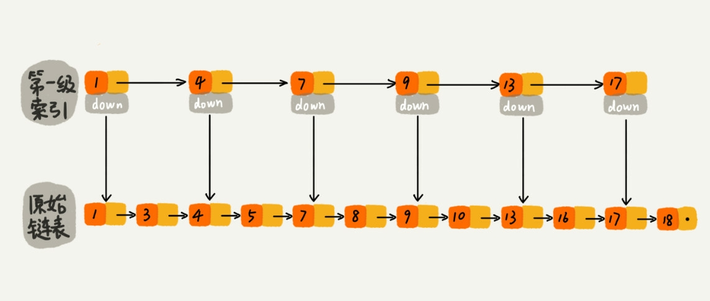
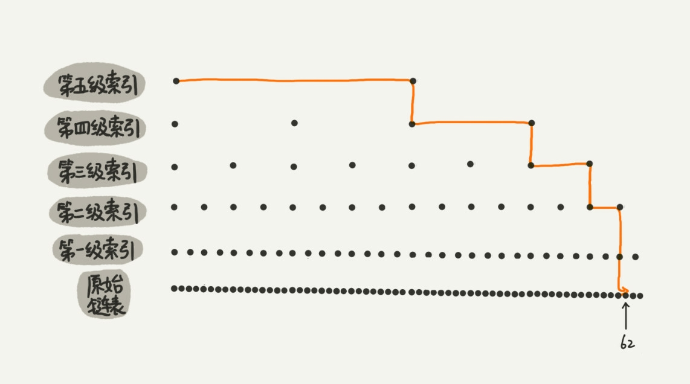
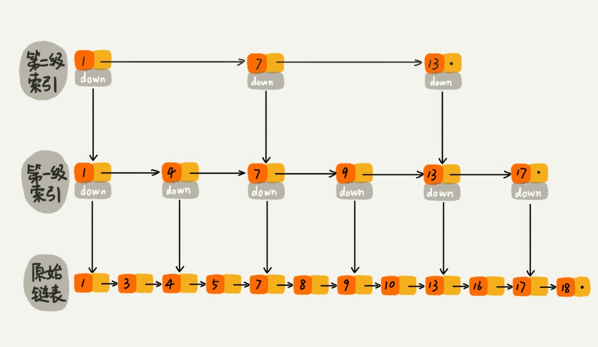
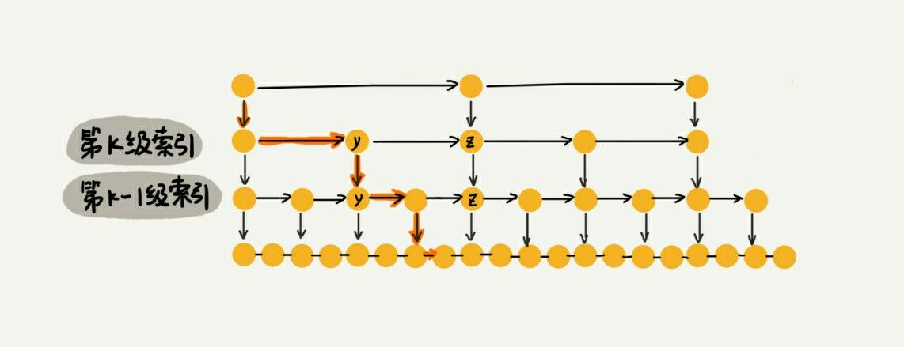
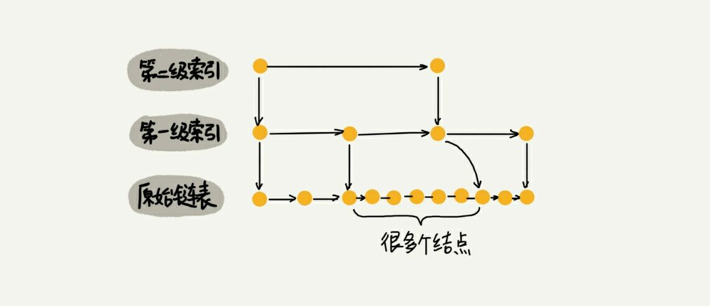
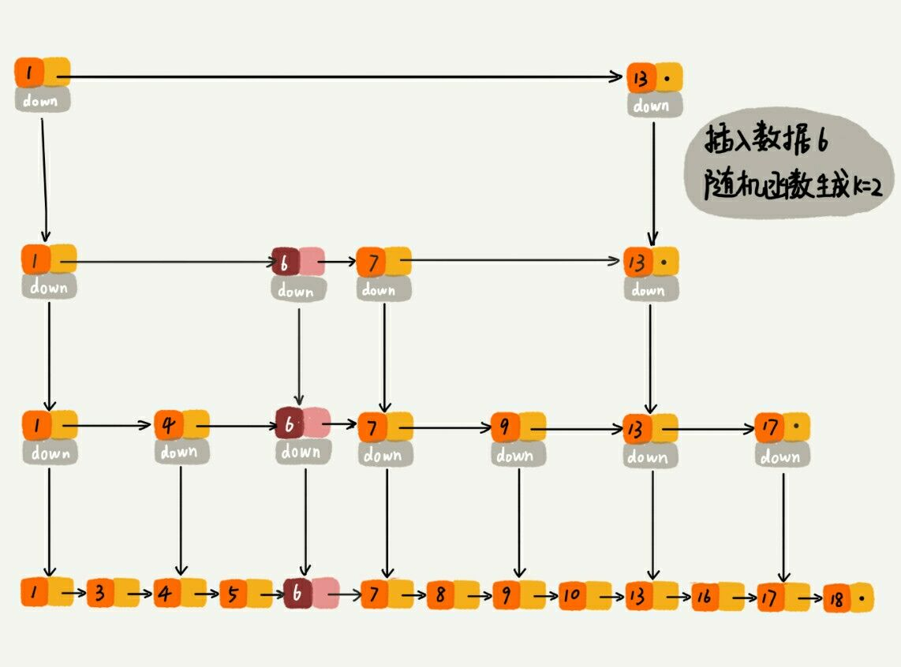

# 为什么 Radis 一定要用跳表来实现有序集合?
## 之前的两讲说了二分查找不能使用链表, 因为二分查找的随机访问的特性, 那么如果数据储存在链表中, 难道就没有办法用二分查找算法了吗?
## 实际上, 可以对链表进行一个改造, 还记得上一讲中的查找循环数组的某个值吗? 这里有类似的思想.我们把改造之后的链表称为**跳表(skip list)**
### 跳表支持快速的'插入, 删除, 查找'操作', 写起来也不复杂, 甚至可以替代红黑树.
## 如何理解跳表?
### 按一定长度建立索引进行跳跃的表, 这样就可以在跳跃的索引中进行值的查找, 比 n 的复杂度要小很多, 如果进一步往上抽, 最后的复杂度可以降到 logn.

- 这是第一级


- 这是第二级


- 这是第三级


### 来看看用跳表查询到底有多快?
#### 如果每两个节点抽一个节点作为上一级的索引节点, 那么上一级节点的数量大约为 n/2, 第二级为 n/4, 第三级为n/8, 第 k 级为n/(2^k), 假设索引有 h 级, 最高级索引只有两个节点, 通过上面的公式可以得到, n/(2^h) = 2, h = log<sub>2</sub>n - 1,如果包含原链表这一层, 那么整个高度就是log<sub>2</sub>n, 如果每一层都要遍历 m 个节点, 那么在调表中查询的时间复杂度为 O(m * log<sub>2</sub>n)

#### 那么这个 m 值应该是多少呢? 按照前面这样的索引结构, 每一级索引最多只需要遍历3个节点.也就是 m=3, 因为每两个节点会抽一个到上一级, 所以注定了只会在三个节点中遍历.如果是每3个抽一个, 那么 m 就等于4, 以此类推, 所以复杂度为 O(logn).但是链表要降到这个复杂度需要额外的空间来储存索引点, 这也是**空间换时间**很直观的一个表现, 那么这个空间复杂度是多少呢?可以看到在之前的分析中, 额外的空间为: n/2 + n/4 + n/8 + ... + 4 + 2 = n - 2, 所以空间复杂度为 O(n)


#### 在实际的开发中, 不用很在意空间复杂度, 因为现在是将数据只看成整数, 但是原始链表中很有可能储存的是对象, 当对象比索引节点大很多的时候, 索引占用的额外空间就可以忽略了.

## 高效的动态插入和删除

### 跳表在插入删除的时间复杂度也是 O(logn), 
#### 先来看插入, 单链表中, 在定位点插入节点的复杂度为 O(1), 但是找到这个要插入的节点时比较费时的, 但是对于跳表来说, 查找某个节点的复杂度为 O(logn), 所以插入的复杂度为 O(logn)
#### 再来看删除, 在删除操作时同样需要查找前节点, 查找的复杂度依然为 logn.
### 跳表索引的动态更新
#### 上面的插入和删除看起来很简单, 但实际上忽略了一个问题, 如果插入节点的数量很多, 多到一定程度之后会退化成为单链表, 因为要遍历一定范围内数量及其多的数据.

### 所以作为一种数据结构, 需要某种手段维护索引与原始链表大小之间的平衡, 如果链表中的节点多了, 索引节点就需要响应的增加一些了避免复杂度退化.

#### 红黑树 AVL 树这样的平衡二叉树是通过左右旋的方式保持左右子树的平衡. 跳表通过随机函数维护平衡性.

#### 往跳表中插入数据的时候, 可以选择同事将这个数据插入到部分索引层中.如果随机函数生成的 k, 那么就将小于 k 的所有索引级都加上该数据.

#### 随机函数实现的方式为(不止这一种, 可以调节权重)
```js
function get_random_level(MAX_LEVEL) {
  var level = 0
  for(var i = 0; i < MAX_LEVEL; i ++) {
    if((parseInt(Math.random) + 1) % 2) {
      level ++
    }
  }
  return level
}
```

## 总结一下, 跳表的特性
- 插入, 删除, 查找的复杂度都为 logn
- 灵活度高, 可自定义随机平衡
- 空间复杂度为 n
- 代码较红黑树来说更简单易懂

```js
const Node = {
  make_node(ele) {return {element:ele, next:null}},
  init(ele) {
    const node = this.make_node(ele);
    this.head = node
    this.end = node
  },
  append(ele) {
    const node = this.make_node(ele)
    this.end.next = node
    this.end = node
  },
  display() {
    let node = this.head
    if (!node) return throw Error('you should use Node.init() to init link list');
    const res = []
    while(node.next) {
      res.push(node.element)
      node = node.next
    }
    res.push(node.element)
    console.log(res)
  },
  current_node: this.head
}
const Skip_List = {
  MAX_LEVEL:0,
  /**
  * node: 链表
  * step: 跳跃度
  */
  init(node, step) {
    for(var i = 0;i > 1; i --) {
      const temp = []
      var j = 0
      while(node.current_node) {
        if (j < step) {
          node.current_node = node.current_node.next
          j ++
          continue
        }
        temp.push(node.current_node)
        j = 0
      }
      final[i] = temp
    }
  },
  find(ele) {

  },
  /**
  * 插入时引入随机函数
  */
  insert(node, ele) {

  },
  random() {
    var level = 0
    for(var i = 0; i < this.MAX_LEVEL; i ++) {
      if((parseInt(Math.random) + 1) % 2) {
        level ++
      }
    }
    return level
  }
}

