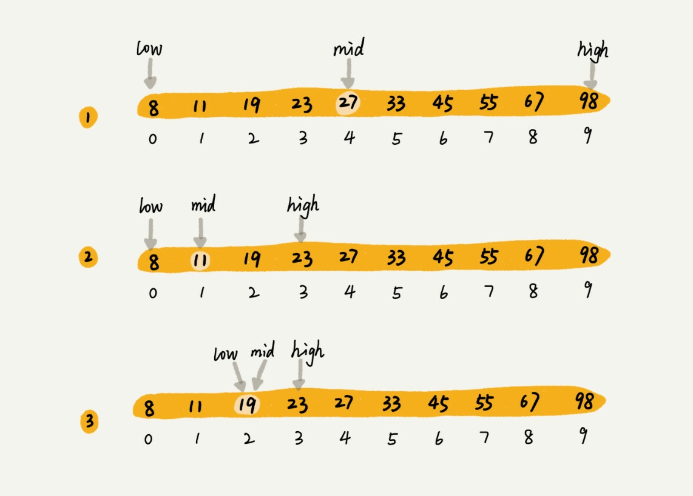

# 如何用最省内存的方式实现快速查找功能

## 开篇问题: 假设有1000万条整数数据, 每个数据占8个字节, 如何设计数据结构和算法, 快速判断某个整数是否出现在这1000万个数据中? 希望内存不要超过100M

## 这时候二分查找就十分的适合这个场景.

### 看一个更简单的例子, 如果有1000条订单信息, 如何知道是否有金额等于19元的订单? 存在返回订单数据, 不存在返回 null

### 当然是可以遍历, 一个一个遍历这1000个订单, 直到找到或者遍历完毕为止, 但是查找较慢

### 假设有10个订单, 金额分别为: [8, 11, 19, 23, 27, 33, 45, 55, 67, 98], 利用二分, 用三个指针, low, high, mid. 如下图所示:



### 看到了吗? 只用了三次查找就查到了需要的元素, 那么如果数据为 n 个呢? 那么一共需要查找多少次呢? 看看查找区间的变化, 在每次二分查找后, 数据都会缩小为原来的一半, 最坏的情况下, 会直到查找区间缩小为空停止. 所以查找区间即为:
> n, n/2, n/2^2, n/2^3, ... , n/2^k, 其中当 n/2^k = 1时. k 就是查找的次数, 也就是 log<sub>2<sub>n,  通常该时间复杂度表示为 logn.

### logn 是一种很高效的算法, 某些情况下比 O(1)还要高效, 因为对于常量级的算法来说, O(1)有可能是非常大的常量, 比如 O(100), O(10000). 下面用代码实现二分查找:

```js
function bsearch(arr, value) {
  var low_p = 0, high_p = arr.length
  function Recursion(low, high) {
    let mid = low + ((high - low)>>1)
    if(low >= high) return -1
    if (arr[mid] === value) {
      console.log(mid)
      return mid
    }
    if (arr[mid] > value) return Recursion(low, mid)
    if (arr[mid] < value) return Recursion(mid, high)
  }
  return Recursion(low_p, high_p)
}
// 非递归, 防止栈溢出
function bsearch(arr, value) {
  var low = 0, high = arr.length, mid;
  while (low < high) {
    mid = low + ((high - low)>>1)
    if (arr[mid] === value) return mid
    if (arr[mid] > value) {
      high = mid
    } else {
      low = mid
    }
  }
  return -1
}
```

### 二分查找的场景:

- 依赖顺序表结构, 简单来说就是数组, 不能依赖链表, 因为需要按照下标随机访问元素, 数组的复杂度为1, 链表为 n, 如果用链表来二分的话, 还不如直接遍历了. 时间复杂度为 n
- 针对有序数据, 如果无序, 则需要按照之前的快排或归并, 进行排序, 最低复杂度都是 nlogn, 但是, 如果我们针对的是一个相对静态的数据, 即: 没有频繁的插入和删除, 可以进行一次排序, 多次二分的办法, 均摊排序的复杂度.但是如果需要频繁的插入和删除, 那么每次插入删除之后都需要排序, 那么成本就会很高, 还不如用遍历了. 当然后面还会说道二叉树, 可以解决这个问题.
- 数据量也不能太大, 因为依赖与顺序表结构, 需要开辟连续的内存空间, 如果太大, 可能无法满足

## 解答开篇: 首先将1000w 个数据从小到大排序, 每个8字节, 需要大概 80m 的数组, 然后利用二分进行查找即可, 因为这1000w 个数据为静态数据, 二分查找可分摊排序复杂度

```js
function quick_sort(arr, start, end) {
  if (start > end) return
  function partition(p, r) {
    var pivot = arr[r]
    var i = p
    for (var j = p; j < r; j++) {
      if (pivot > arr[j]) {
        [arr[i], arr[j]] = [arr[j], arr[i]]
        i++ 
      }
    }
    [arr[i], arr[r]] = [arr[r], arr[i]]
    return i;
  }
  let q = partition(start, end)
  quick_sort(arr, start, q-1)
  quick_sort(arr,q+1, end)
}
function bsearch(arr, value) {
  var low = 0, high = arr.length, mid;
  while (low < high) {
    mid = low + ((high - low)>>1)
    if (arr[mid] === value) return mid
    if (arr[mid] > value) {
      high = mid
    } else {
      low = mid
    }
  }
  return -1
}
quick_sort(origin_arr, 0, origin_arr.length - 1)
let res = bsearch(origin_arr, value)
```

## 思考题

### 如何编程实现“求一个数的平方根”？要求精确到小数点后 6 位。

因为要精确到后六位，可以先用二分查找出整数位，然后再二分查找小数第一位，第二位，到第六位。

整数查找很简单，判断(当前数/2)的平方小于, +1后大于即可找到，

小数查找举查找小数后第一位来说，从x.0到(x+1).0，查找终止条件与整数一样，当前数小于，加0.1大于，

后面的位数以此类推，可以用x*10^(-i)通项来循环或者递归，终止条件是i>6，

想了一下复杂度，每次二分是logn，包括整数位会查找7次，所以时间复杂度为7logn。空间复杂度没有开辟新的储存空间，空间复杂度为1。

### 代码实现
```js
function get_sqrt(num) {
  var origin = num, left = num
  var res = parseInt(num ** (1/2))
  for(var i = -1; i> -7; i--) {
    for (var j = 0; j < 10; j++) {
      if ((res + j * 10 ** i) ** 2 <= num && (res + (j + 1) * 10 ** i)**2 > num ) {
        res = res + j * 10 ** i
        break
      }
    }
  }
  console.log(res)
}
```